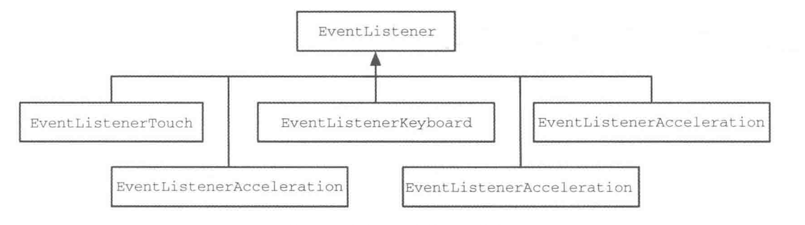
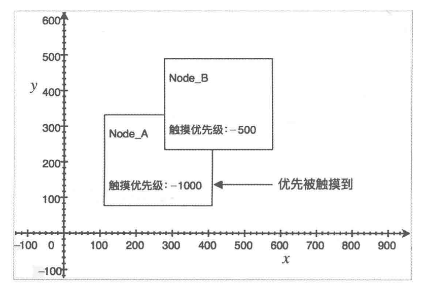
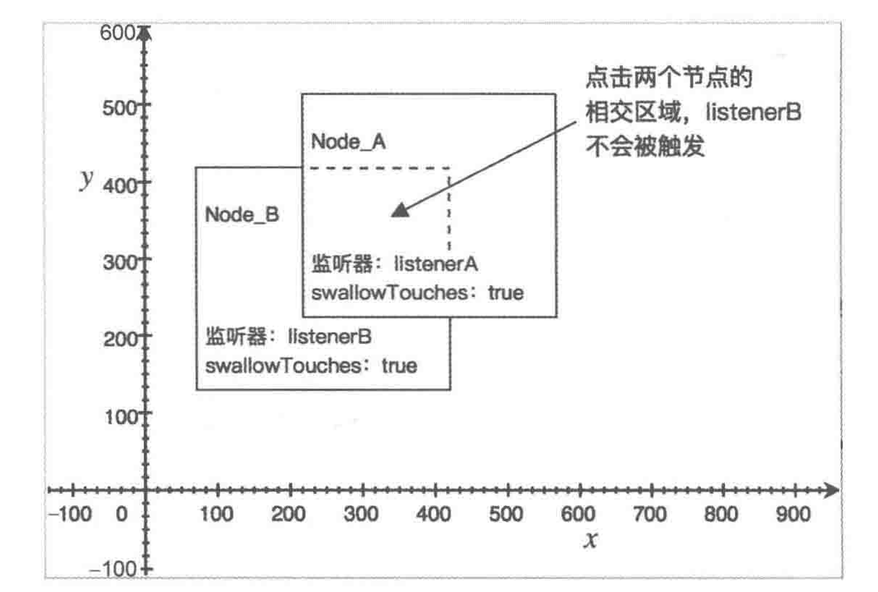
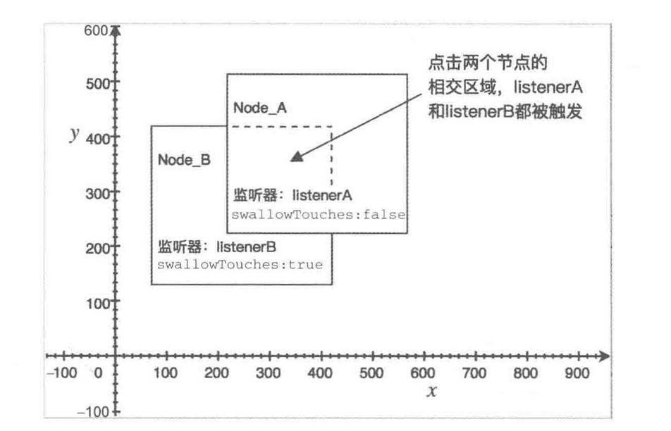

# 事件机制

## 事件

Cocos2d-JS 为处理事件封装了 3 个相关的类，每个事件的处理都是由这三个部分组成，它们分别是 `cc.Event(事件对象)`、`cc.EventListener(事件监听器)` 和 `cc.EventManager(事件管理器)`。cc.Event 对象携带着事件相关的信息，例如事件类型、事件回调函数等。cc.EventListener 封装了用户的事件处理逻辑，而 cc.EventManager 则管理用户注册的事件监听器，根据触发的事件类型分发给相应的事件监听器。

每个事件的事件源可以是层、精灵、菜单等节点对象，事件的逻辑处理都在各个事件监听器（cc.EventListener）中。每个事件监听器都需要被添加到事件管理器中，这使得当有事件被触发时，事件管理器能够根据事件的类型把事件分发给相应的事件监听器，事件监听器收到事件之后，开始处理事件的业务逻辑。

Cocos2d-JS 提供了 5 种事件监听器，它们的继承关系如图：



> 在 Cocos2d-x 中，有事件分发器的概念。实际上，Cocos2d-JS 中的事件管理器就是事件分发器。我们可以在 `frameworks/js-bindings/bindings/script/jsb_boot.js` 中看到这样一行代码：
>
> ```javascript
> cc.eventManager = cc.director.getEventDispatcher();
> ```

## 事件管理器

顾名思义，事件管理器就是负责管理事件监听器的，它是事件监听器的大总管，管理事件监听器的添加、删除以及分发。cc.EventManager 是一个单例类，cc.eventManager 为 cc.EventManager 的单例对象，它通过下面这些函数管理各类事件监听器。

### 添加事件监听器

每个事件监听器都需要添加到事件管理器对象中，添加事件监听器的函数如下：

```javascript
// listener: 事件监听器对象；
// nodeOrPriority: 一个 Node 对象或者是一个数值。若给定的参数为数值，则数值越低，事件的优先级越高。
// 若给定的参数为一个 Node 对象，则事件的优先级取决于 Node 对象的 LocalZOrder，该值越大，事件优先级越高。
cc.eventManager.addListener(listener, nodeOrPriority);
```

除此之外，cc.EventListener 还允许添加自定义事件。自定义事件取代了 Cocos2d-x 2.x 版本中的 CCNotificationCenter。可以通过如下 API 添加自定义事件：

```javascript
cc.eventManager.addCustomListener(eventName, callback);
// 通常情况下，eventName 为自定义事件的名字，是字符串类型，callback 为事件的回调函数。
```

### 删除事件监听器

删除和添加总是成对存在的，当你不再需要事件监听器的时候，可以通过 cc.EventListener 的如下函数移除：

```javascript
// 删除指定监听器
cc.eventManager.removeListener(listener);
// 删除指定类型监听器
cc.eventManager.removeListeners(listenerType, recursive);
// 删除指定自定义监听器
cc.eventManager.removeCustomListeners(customEventName);
// 删除所有监听器
cc.eventManager.removeAllListeners();
// 删除 target 下指定类型的监听器
cc.eventManager.removeEventListener(type, target);
```

### 设置事件监听器的优先级

每个事件监听器都具有优先级，优先级可以通过如下代码给事件设置或更改：

```javascript
cc.eventManager.setPriority(listener,fixedPriority);
```

另外，前面提到过，在 cc.eventManager 中添加事件监听器的时候，便可直接设定事件监听器的优先级，示例代码如下：

```javascript
cc.eventManager.addListener(listenerA, -1000);
cc.eventManager.addListener(listenceB, -500);
```

将代码转为示意图，就如下图所示，Node_A 和 Node_B 都注册了触摸事件，Node_A 的触摸事件优先级是 -1000，Node_B 的触摸优先级是 -500，虽然 Node_B 在 Node_A 的上方，但是 Node_A 却优先被触摸到。



> 或许你已经注意到了，此时，并没有看到事件监听器是如何和需要的节点进行关联的。实际上，每个事件监听器都有 target 属性，它指向需要被监听的事件对象，也就是事件源。

### 分发事件

当有事件被触发时，cc.eventManager 会将收到的事件分发给对应的事件监听器。事件分发的相关 API 代码如下：

```javascript
cc.eventManager.dispatchEvent(event); // 分发事件
// 分发自定义事件
cc.eventManager.dispatchEvent(eventName, userData);
```

第一行代码为 cc.eventManager 分发 Cocos2d-JS 封装好的事件，参数 event 是一个事件对象。而第 3 行代码中的eventName 参数为用户自定义事件的名字，是一个字符串类型，userData 为事件携带的数据，可以是一个对象等。另外，userData 参数可省略。实际上，cc.eventManager.dispatchCustomEvent(eventName, userData) 函数是对 cc.eventManager.dispatchEvent(event) 函数的二次封装，它的源代码如下：

```javascript
cc.eventManager.dispatchCustomEvent = function (eventName, userData) {
    var ev = new cc.EventCustom(eventName);
    ev.setUserData(optionUserData);
    this.dispatchEvent(ev);
} 
```

## 触摸事件

毫无疑问，在移动设备上，触摸事件是用户交互方式中最为基础的一种，通常包含点击、滑动、抬起。触摸又分单点触摸和多点触摸两种。

### 单点触摸

Cocos2d-JS 将单点触摸标记为 cc.EventListener.TOUCH_ONE_BY_ONE，你可以通过如下代码创建一个单点触摸的事件监听器：

```javascript
var listener = cc.EventListener.create({
    event: cc.EventListener.TOUCH_ONE_BY_ONE,
    swallowTouches: true, // 是否吞噬触摸
    target: this, // 指定事件源
    onTouchBegan: function (touch, event) {
        // 获取当前触发事件的对象
        var target = event.getCurrentTarget();
        // 将点击坐标转换为基于当前触发事件对象的本地坐标
        var posInNode = target.convertToNodeSpace(touch.getLocation());
        // 获取当前节点大小
        var size = target.getContentSize();
        // 区域设定
        var rect = cc.rect(0, 0, size.width, size.height);
        // 判断触摸点是否在节点区域内
        if (!(cc.rectContainsPoint(rect, posInNode))) {
            return false;
        }
        // TODO something
        return true;
    },
    onTouchMoved: function (touch, event) {
        var target = event.getCurrentTarget();
        var delta = touch.getDelta(); // 获取滑动距离
        target.x += delta.x;
        target.y += delta.y;
    },
    onTouchEnded: function (touch, event) {
        // TODO something
    }
});
```

第 1 行代码通过 cc.EventListener 类创建了一个事件监听器对象，第 2 行代码指定当前监听器监听的事件类型为 TOUCH_ONE_BY_ONE，表示单点触摸，而第 3 行的 swallowTouches 表示是否吞噬触摸事件，当 swallowTouches 被设置为 true 之后，触摸事件将不再向下传递。

假设你现在有两个事件监听器 listenerA 和 listenerB，listenerA 的事件优先级比listenerB 高，listenerA 监听节点 Node_A，listenerB 监听节点 Node_B。若 listenerA 中事件对象的 swallowTouches 值为 true 的话，那么点击 Node_A 触发 listenerA 时，触摸事件被吞噬，listenerB 将不被触发，即 Node_B 不会接收到触摸事件。若 listenerA 的 swallowTouches 的值为 false，则 listenerA 和 listenerB 将依次被触发。





第 5 行的 onTouchBegan、第 21 行的 onTouchMoved 和第 27 行的 onTouchEnded 为触摸事件的回调函数，分别表示触摸开始、触摸移动、触摸结束。值得注意的是，在这三个方法当中，this 并不是指向当前监听器监听的节点，而是指向事件监听器本身。所以，通常所要获取的 this 对象实际上是事件监听器的 target （监听对象，事件源），target 一般是 cc.Node 或者 cc.Node 的子类，例如 cc.Layer、cc.Sprite 等。通过在第 7 行代码，可以获取到这个 target。

当获取到 target 之后，需要判断当前触摸点是否正确触摸到了 target，第 8 行到第 17 行就是做了这一件事情。首先，将触摸点转为 target 到本地坐标，然后获取下 target 的大小，再根据 target 的大小生成一块区域，再通过 cc.rectContainsPoint(rect, posInNode) 函数判断转换后的 posInNode 是否在 target 的区域内，若不是，则返回 false，若是，继续执行代码，最后返回 true。当返回 false 之后，onTouchMoved 和 onTouchEnd 将不被调用。

第 21 行是一个非常有用的功能，它返回上一次 onTouchMoved 和第一次 onTouchMoved的触摸偏移量，并且有正负值，利用这个值，可以实现移动 target，也可以实现滑动方向的获取，这在平常的开发中，是非常有用的一个功能。

当事件监听器创建完毕之后，通过下面代码便可以对指定的节点添加触摸事件监听：

```javascript
cc.eventManager.addListener(listener, sprite1);
cc.eventManager.addListener(listener.clone(), sprite2);
cc.eventManager.addListener(listener.clone(), sprite3);
```

### 多点触摸

多点触摸被标记为 cc.EventListener.TOUCH_ALL_AT_ONCE。与单点触摸不同的是，多点触摸不支持事件吞噬，也就是说，多点触摸没有办法穿透下去。另外，多点触摸的事件相关处理函数是 onTouchesBegan、onTouchesMoved、onTouchesEnded，这与单点触摸也有所不同，如下面代码中的第 5 行到第 7 行所示：

```javascript
// 判断当前平台是否支持多点触摸
if ('touches' in cc.sys.capabilities) {
    var listener = cc.EventListener.create({
        event: cc.EventListener.TOUCH_ALL_AT_ONCE，
        onTouchesBegan: this.onTouchesBegan,
        onTouchesMoved: this.onTouchesMoved,
        onTouchesEnded: this.onTouchEnded
    });
    cc.eventManager.addListener(listener, this);
} else {
    // 当前平台不支持多点触摸
}
```

当然， 在例如 onTouchesBegan、onTouchesMoved 和 onTouchesEnded 事件处理函数中，获取出多个触摸点，代码如下：

```javascript
onTouchesBegan: function (touches, event) {
    var self = event.getCurrentTarget();
    // touches[0] 表示捕获第一个触摸点，touches 为触摸点集合
    for (var i = 0; i < touches.length; i++) {
        var touch = touches[i];
        var pos = touch.getLocation();
        var id = touch.getID();
        // 获取点击坐标（基于本地坐标）
        var locationInNode = self.convertToNodeSpace(touch.getLocation());
        // 获取当前节点大小
        var size = self.getContentSize();
        // 区域设定
        var rect = cc.rect(0, 0, size.width, size.height);
        // 判断触摸点是否在节点区域内
        if (!(cc.rectContainsPoint(rect, locationInNode))) {
            return false;
        }
        cc.log("onTouchesBegan at: " + pos.x + " " + pos.y + " Id:" + id);
        return true;
    }
}
```

## 加速计事件

或许对不熟悉移动应用开发的朋友来说，加速计这个词可能有点陌生，因为我们更常听到的是另一个名词——重力感应。其实，重力感应这个说法并不准确，因为加速计感应的并非只有一个重力加速度（g），还包括设备本身移动的加速度。当只有设备静止放置在地上的时候，加速计所接收到当所有加速度的矢量和才会等于重力加速度。这时候才算是重力感应。

加速计会感应到 x、y 和 z 三个方向上的加速度分量，x 值是水平方向上的分量，y 值是竖直方向上的分量，而 z 值是垂直于屏幕的方向上的分量。另外，加速计感应事件和前面提到的触摸事件有所不同，加速计事件需要 `cc.inputManager` 对象开启加速计之后才可以正常使用。另外，加速计事件的回调函数会接收到一个携带加速度分量数值的参数，代码如下：

```javascript
// 判断当前平台是否支持多点触控
if ('accelerometer' in cc.sys.capabilities) {
    // 开启加速计
    cc.inputManager.setAccelerometerEnabled(true);
    var listener = cc.EventListener.create({
        event: cc.EventListener.ACCELERATION,
        callback: function (acc, event) {
            cc.log("accX = ", acc.x);	// x 分量
            cc.log("accY = ", acc.y);	// y 分量
            cc.log("accZ = ", acc.z);	// z 分量
        }
    });
    cc.eventManager.addListener(listener, this);
} else {
    cc.log("不支持加速计事件");
}
```

除此之外，你可以通过 cc.inputManager.setAccelerometerInterval(number) 函数来设置加速计监听的间隔时间，其默认值为 1/30，一般保持默认值即可。

## 键盘事件

移动设备虽然已经偏向屏幕触摸操作多年，但是设备上还是存在一些非虚拟按键（物理按键或者触感按键），加上 Cocos2d-JS 是跨全平台的游戏引擎，支持发布到 Mac OS X 以及 Windows 等平台上，所以，Cocos2d-JS 将这些案件事件都统一封装为键盘事件。按键事件到回调函数会接收到一个携带按键编码（KeyCode）的参数，例如：

```javascript
// 判断当前平台是否支持键盘事件
if ('keyboard' in cc.sys.capabilities) {
    var listener = cc.EventListener.create({
        event: cc.EventListener.KEYBOARD,
        target: this,
        onKeyPressed: function (keyCode, event) {
            var keyCodeStr = String.fromCharCode(keyCode); // 按键编码转为字符
            cc.log(keyCodeStr + "(" + keyCode.toString() + ")按下");
        },
        onKeyReleased: function (keyCode, event) {
            var keyCodeStr = String.fromCharCode(keyCode); // 按键编码转为字符
            cc.log(keyCodeStr + "(" + keyCode.toString() + ")释放");
        }
    });
    cc.eventManager.addListener(listener, this);
} else {
    cc.log("键盘事件不支持");
}
```

可以看出，键盘事件的回调函数有两个，onKeyPressed 函数在按键按下时触发，onKeyReleased 在按键被松开时触发，一般可以考虑在 onKeyReleased 函数中做逻辑处理。

## 鼠标事件

虽然触摸事件也支持电脑上鼠标的点击、拖拽、抬起事件，但是触摸事件并不支持鼠标右键按下、滚轮滚动等操作，这是因为它们确确实实属于鼠标事件。Cocos2d-JS 鼠标事件标记为 cc.EventListener.MOUSE，提供 4 个鼠标事件回调函数，分别是：按键按下（onMouseDown）、按键松开（onMouseUp）、鼠标移动（onMouseMove）、和滚轮移动（onMouseScroll）。鼠标事件的使用代码如下：

```javascript
// 判断当前平台是否支持鼠标事件
if ("mouse" in cc.sys.capabilities) {
    var listener = cc.EventListener.create({
        event: cc.EventListener.MOUSE,
        target: this,
        onMouseDown: function (event) {	// 鼠标事件（按下）
            var pos = event.getLocation();
            var button = event.getButton();
            if (button == cc.EventMouse.BUTTON_LEFT) {	// 左键
                cc.log("左键按下", + pos.x + " " + pos.y);
            } else if (button == cc.EventMouse.BUTTON_RIGHT) {	// 右键
                cc.log("右键按下", + pos.x + " " + pos.y);
            } else if (button == cc.EventMouse.BUTTON_MIDDLE) {	// 滚轮
                cc.log("中间滚轮按下");
            }
        },
        onMouseUp: function (event) { // 鼠标事件（抬起）
            
        },
        onMouseMove: function (event) {	// 鼠标事件（移动）
            var pos = event.getLocation();
            cc.log("鼠标当前位置：", pos.x, pos.y)
        },
        onMouseScroll: function (event) {	// 鼠标事件（移动）
            var pos = cc.p(event.getScrollX(), event.getScrollY());
            cc.log("鼠标滚轮移动x: ", pos.x + " y: " + pos.y);
        }
    });
    cc.eventManager.addListener(listener, this);
} else {
    cc.log("不支持鼠标事件");
}
```

## 自定义事件

除了上述的几个事件之外，引擎还封装了一个自定义事件，它取代了 Cocos2d-x 2.x 版本中的通知中心 CCNotificationCenter。下列代码创建了一个自定义事件，并将其添加到事件管理器中：

```javascript
// 创建自定义函数
var listener = cc.EventListener.create({
    event: cc.EventListener.CUSTOM,
    target: this,	// 事件源
    eventName: "custom_event", // 事件名
    callback: function (event) {	// 回调函数
        var target = event.getCurrentTarget(); // 事件源对象
        cc.log("自定义事件被触发...\n携带数据：", event.getUserData());
    }
});
cc.eventManager.addListener(listener, this);
```

上面第 5 行代码指定了该自定义事件的事件名称，其类型是字符串类型，该属性用于区分自定义事件。在实际开发中，你应该将自定义事件名定义成一个常量，例如 cc.EventListener.TOUCH_ONE_BY_ONE。

分发自定义事件需要先根据事件名创建出指定的自定义事件对象，你可以给创建出来的对象设置一个用户数据，这样便可以在事件分发的时候将数据传输给事件监听者，然后通过事件管理器分发自定义事件，代码如下：

```javascript
var event = new cc.EventCustom("custom_event"); // 创建自定义事件
var data = {	// 定义数据
    name: "xxx",
    age: 23,
    hobby: "xxx"
};
event.setUserData(data);
cc.eventManager.dispatchEvent(event); // 分发事件
```

