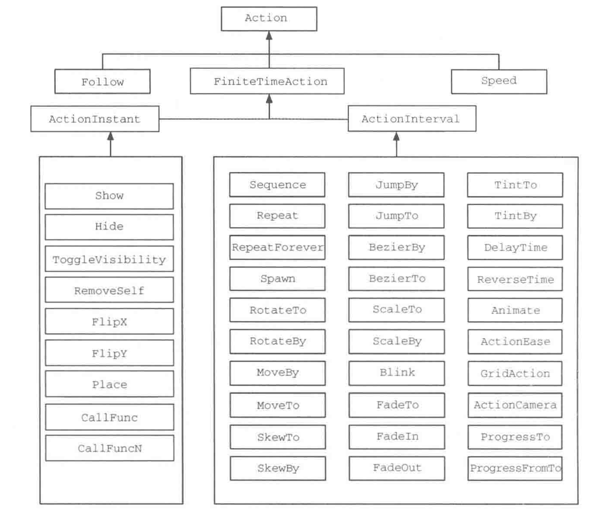
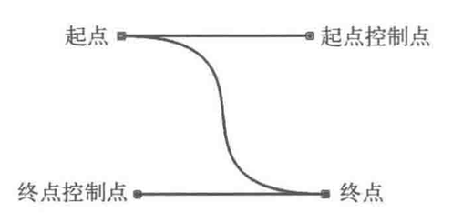
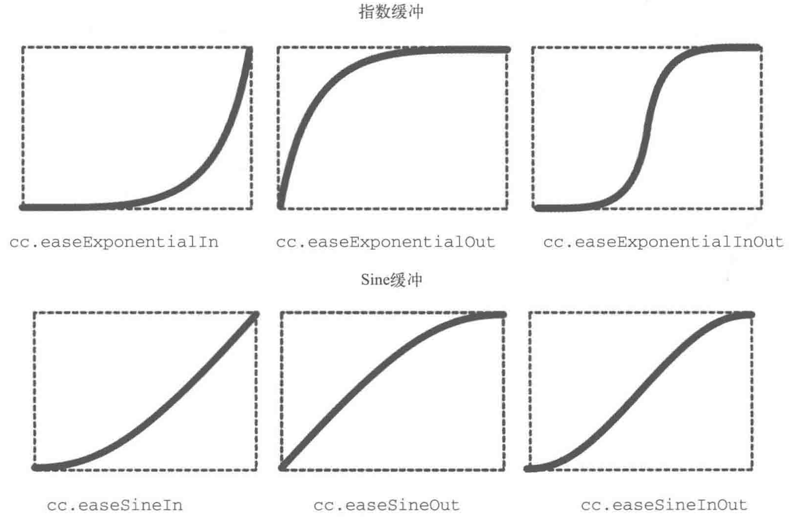
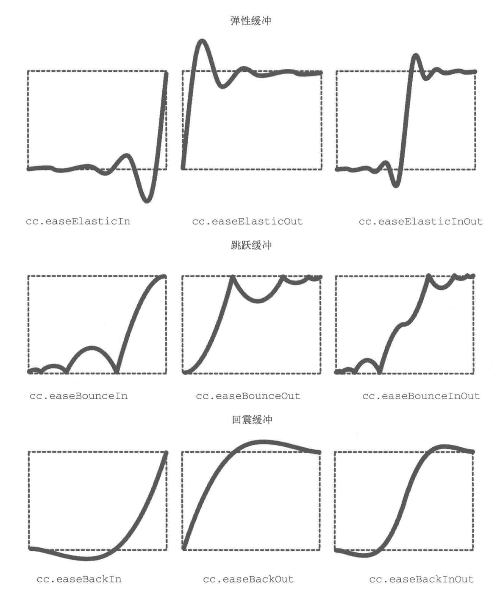

# 动作模块

## cc.Action

动作作用于 cc.Node，每个节点都可以通过 runAction(action) 函数运行一个或多个动作，每个动作保存着指定的规则供节点运作。在 Cocos2d-JS 中，动作对应的类是 cc.Action，它是所有动作类的父类，其构造函数如下：

```javascript
cc.Action = cc.Class.extend({
    originalTarget: null,
    target: null,
    tag: cc.ACTION_TAG_INVALID,
    ctor: function () {
        this.originalTarget = null;
        this.target = null;
        this.tag = cc.ACTION_TAG_INVALID;
    }
    // ......
});
```

该类定义了 3 个属性：初始目标（originalTarget）、目标（target）以及动作标签（tag）。动作是允许克隆的，originalTarget 始终指向第一次运行此动作的节点，而 target 则为当前正在运行此动作的节点，tag 则是一个动作的唯一标识，它的默认值为 -1。tag 一般被用在 cc.Node 的 stopActionByTag(tag) 等函数中。

动作类的大多数实现类都继承有限时间类（cc.FiniteTimeAction），cc.FiniteTimeAction 类定义了 reverse() 函数，调用此函数可以获得一个与当前动作相反的动作，这称为逆动作。例如，一个精灵运行了旋转负 45<sup>o</sup> 的动作，那么调用 reverse() 函数，将返回一个旋转正 45 <sup>o</sup> 的动作，但是并不是所有的动作都可返回逆动作。另外，cc.FiniteTimeAction 还派生出瞬间动作 cc.ActionInstant 和持续动作 cc.ActionInterval，它们各自的子类继承关系如图所示：



## 瞬间动作

在一帧内执行结束的动作称为瞬间动作。cc.ActionInstant 是所有瞬间动作类的父类，例如 cc.Place、cc.Hide、cc.RemoveSelf 等都是瞬间动作。

### cc.Place

cc.Place 的作用是将节点放置到某个指定位置，实际上它只是修改了节点的 position 坐标。所以，若你想通过一个动作将节点放置到屏幕坐标(100, 86)，可以像下面这样做：

```javascript
var place = cc.place(100, 86);
node.runAction(place);
```

> Cocos2d-JS 简化了动作的创建方式，为所有的动作定义了快速创建的函数。例如，cc.place 函数的实现如下：
>
> ```javascript
> cc.place = function (pos, y) {
>     return new cc.place(pos, y);
> };
> ```

### cc.FilpX 和 cc.FilpY

cc.FilpX 和 cc.FilpY 这两个动作在本质上是一样的，只是作用的方向不同。cc.FilpX 是将目标水平翻转，而 cc.FilpY  则是将目标垂直翻转，true 和 false 表示是否翻转。一般情况下，cc.FilpX 和 cc.FilpY 作用于 cc.Sprite 或 cc.Sprite 的字类上，代码如下：

```javascript
var filpX = cc.filpX(true);
var filpY = cc.filpY(false);
```

### cc.Show 和 cc.Hide

几乎所有即时动作的实现都是直接修改其对应的属性，cc.Show 和 cc.Hide 也不例外。cc.Show 和 cc.Hide 通过修改节点的 visible 属性来达到显示和隐藏的功能。通过下列代码可以创建一个显示或隐藏的动作：

```javascript
var show = cc.show(); // 创建一个 显示 动作
var hide = cc.hide(); // 创建一个 隐藏 动作
```

### cc.ToggleVisibility

cc.ToggleVisibility 动作可以切换节点的可视（Visibility）属性，当节点可见时，运行此动作，则节点会被隐藏，反之同理。创建 cc.ToggleVisibility 动作的代码如下：

```javascript
var toggleVisibility = cc.toggleVisibility();
```

### cc.RemoveSelf

顾名思义，cc.RemoveSelf 就是将正在运行此动作的节点从父节点移除，它实际是调用了 target（正在运行此动作的节点）的 removeFromParent(isNeedCleanUp) 函数。你可以在 cc.RemoveSelf 的 update 函数中看到如下代码：

```javascript
update: function () {
    this.target.removeFromParent(this._isNeedCleanUp);
}
```

cc.RemoveSelf 类中声明了一个属性 `_isNeedCleanUp`，该属性默认为 true，表示目标节点以及它所关联的动作、调度器等都将被移除。若 `_isNeedCleanUp` 为 false，则只移除目标节点。

cc.RemoveSelf 的构造函数是一个有参构造函数，因为 _isNeedCleanUp 的默认值为 true，所以在实际开发中可以省略这个参数，相关代码如下：

```javascript
var moveSelf = cc.removeSelf(); // 等同于 cc.removeSelf(true)
var moveSelf = cc.removeSelf(false); 
```

### cc.CallFunc

cc.CallFunc 是即时动作中较为特殊的一种，它将一个函数包装成动作，当节点运行此动作的时候，便会回调此函数。通常情况下，cc.CallFunc 会结合复合动作使用。例如，主角 2 秒内移到屏幕(100, 200)后，说了一句“我已经到达指定地点”。那么，这个功能的实现代码如下：

```javascript
var moveTo = cc.moveTo(2, cc.p(100, 200));
var callback = cc.callFunc(function () {
    cc.log("我已经到达指定地点");
}.bind(this));
node.runAction(cc.sequence(moveTo, callback));
```

## 持续动作

需要持续一点时间才能完成的动作称为持续动作，例如花 2 秒的时间让精灵移动到屏幕坐标(300, 200)的位置。由于持续动作需要持续一端时间才能完成，所以所有得持续动作都需要接收一个用于控制动作执行时间的参数 duration。

大部分的持续动作可以分为两种——xxTo 和 xxBy，前者表示最终值，而后者表示相对改变值。

```javascript
var moveTo = cc.moveTo(1, cc.p(-20, 50)); // 用 1 秒时间将节点移动到屏幕坐标为(-20, 50)的位置
var moveBy = cc.moveBy(1, cc.p(-20, 50)); // 相对当前坐标进行 X 轴偏移 -20，Y 轴偏移 50
```

根据持续动作的作用不同，我们将持续动作分为属性变化动作和视觉特效动作两大类。

### 属性变化动作

属性变化动作，即运行动作的过程中会改变节点对应属性的动作，它们大概有如下几种。

#### cc.MoveTo 和 cc.MoveBy

Move 动作使节点做直线运动，通常用来移动游戏内的角色等，其函数原型如下：

```javascript
cc.moveTo(duration, position, y);
cc.moveBy(duration, position, y);
```

其中，参数 duration 为持续时间，position 可以为 cc.p(x, y) 类型的值，也可以为坐标的 x 值。当 position 为 cc.p(x, y) 时，y 可以省略。

```javascript
// 用时 1 秒，将节点移动到屏幕(128, 80) 的位置
var moveTo = cc.moveTo(1, cc.p(125, 80)); // 等同于 cc.moveTo(1, 125, 80)
// 用时 1 秒，节点相对当前坐标，X 轴向左移动 88，Y 轴向上移动 99
var moveBy = cc.moveBy(1, cc.p(-88, 99)); // 等同于 cc.moveBy(1, -88, 99)
```

#### cc.jumpTo 和 cc.jumpBy

jump 动作以一定的轨迹让节点跳跃到指定的位置，其 API 如下：

```javascript
cc.jumpTo(duration, position, y, height, jumps);
cc.jumpBy(duration, position, y, height, jumps);
```

可以发现，形参中也有 position，这意味着若传入进去的参数为 cc.p(x, y) 类型的参数，则 y 同样可以省略。height 为跳跃高度，jumps 为跳跃的次数。

```javascript
// 1 秒时间，跳到(100, 86)，跳跃高度为 50 像素，总共跳跃 4 次
var jumpTo = cc.jumpTo(1, cc.p(100, 86), 50, 4);
// 1 秒时间，原地跳，跳跃高度为 100 像素，总共跳跃 4 次
var jumpBy = cc.jumpBy(1, cc.p(0, 0), 100, 4);
node.runAction(cc.sequence(jumpTo, jumpBy));
```

> cc.sequence 动作将一组动作包装成一个序列，然后挨个执行。

#### cc.BezierTo 和 cc.BezierBy

Bezier 动作可以让节点做曲线运动，而曲线则由贝塞尔曲线描述。贝塞尔曲线又称贝兹曲线或贝济埃曲线，是应用于二维图形应用程序的数学曲线。

每条贝塞尔曲线都包含一个起点和一个终点。在一条曲线中，起点和终点各自包含一个控制点，而控制点到起点（或终点）的连接线称作控制线，所以每条贝塞尔曲线应该有两条控制线和两个控制点。控制点和起点（或终点）的角度以及长度决定了曲线的形状



Bezier 动作的 API 如下：

```javascript
cc.bezierTo(duration, control);
cc.bezierBy(duration, control);
```

其中，control 参数为贝塞尔曲线的描述信息，它接收三个点坐标，分别是起点控制点、终点控制点、终点。所以，当你需要创建一个 Bezier 动作时，应该先配置好贝塞尔曲线的描述信息

```javascript
var size = cc.winSize;
// 条件：当前节点坐标为 cc.p(0, 0)
// 要求：用 1 秒时间做贝塞尔曲线运动，将节点从当前位置移动到屏幕右下角
var bezierToConfig = [
    cc.p(0, size.height),	// 起点控制点
    cc.p(size.width, size.height),	// 终点控制点
    cc.p(size.width, 0)	// 终点
];
var bezierTo = cc.bezierTo(1, bezierToConfig);

// 条件：当前节点坐标为 cc.p(cc.winSize.width, 0)
// 要求：用 1 秒时间做相对贝塞尔曲线运动，将 X 轴往负方向移动到屏幕宽度的一半
var bezierByConfig = [
    cc.p(0, size.height),
    cc.p(-size.width / 2, size.height),
    cc.p(-size.width / 2, 0)
];
var bezierBy = cc.bezierBy(1, bezierByConfig);
node.runAction(cc.sequence(bezierTo, bezierBy));
```

实际上，在 Adobe Photoshop中，钢笔工具就是贝塞尔曲线的应用。所以，在开发中，我们可以利用 Adobe Photoshop 的钢笔工具调出贝塞尔曲线，然后将参数搬到代码中，即可得到你想要的 Bezier 动作。

#### cc.ScaleTo 和 cc.ScaleBy

scale 动作可以让节点在指点的时间内进行缩放，其 API 如下：

```javascript
cc.scaleTo(duration, sx, sy);
cc.scaleBy(duration, sx, sy);
```

可以发现，除了 duration 参数之外，还有 sx 和 sy 这两个参数，它们分别表示 X 轴和 Y 轴上的缩放。但是在实际开发中，更多的需求是对整个节点进行缩放，所以，你只需指定一个整体缩放系数即可。这使得 sy 参数必定成为一个可以省略的参数，当 sy 省略时，cc.ScaleTo 或 cc.ScaleBy 的 _endScaleY 属性会被强制设置为 sx 的值，这样便可实现 X 轴和 Y 轴的缩放比例一致。

```javascript
// 用 1 秒的时间，把图片缩放到 原始 大小的 50%
var scaleTo = cc.scaleTo(1, 0.5);
// 用 1 秒的时间，把图片缩放到 当前 大小的 200%
var scaleBy = cc.scaleBy(1, 2);
// 用 1 秒时间，把 X 方向缩放到 原始 大小的 50%，Y 方向缩放到 原始 大小的 150%
var scale = cc.scaleBy(1, 0.5, 1.5);
var scaleReverse = scale.reverse();
node.runAction(cc.sequence(scaleTo, scaleBy, scale, scaleReverse));
```

#### cc.RotateTo 和 cc.RotateBy

Rotate 动作用于旋转节点，其 API 如下：

```javascript
cc.rotateTo(duration, deltaAngleX, deltaAngleY);
cc.rotateBy(duration, deltaAngleX, deltaAngleY);
```

和 Scale 类似，cc.rotateTo(或 cc.rotateBy)的 deltaAngleY 也是可省略的。

```javascript
// 用 1 秒时间，将 X 轴旋转到 -90 度，Y 轴旋转到 -45 度
var rotate = cc.rotateTo(1, -90, -45);
// 用 1 秒时间，整体旋转到 90 度
var rotateTo = cc.rotateTo(1, 90);
// 用 1 秒时间，基于 当前 的角度整体旋转 -90 度
var rotateBy = cc.rotateBy(1, -90);
```

> 在 Cocos2d-JS中，垂直 X 轴向上表示 0 度，垂直 Y 轴向右表示 90 度。

### 视觉特效动作

视觉特效动作可以使节点实现一些视觉效果，常见的视觉效果有淡入、淡出、闪烁、帧动画等。

#### cc.FadeIn、cc.FadeOut 和 cc.FadeTo

cc.fadeIn 和 cc.fadeOut 用来实现节点的淡入淡出效果，cc.fadeTo 实现节点的透明度变化，其 API  如下：

```javascript
cc.fadeIn(duration);
cc.fadeOut(duration);
cc.fadeTo(duration, opacity);
```

```javascript
// 用 1 秒时间淡出
var fadeOut = cc.fadeOut(1);
// 用 1 秒时间淡入
var fadeIn = cc.fadeIn(1);
// 用 1 秒时间将透明度渐变到半透明（128）
var fadeTo = cc.fadeTo(1, 128);
node.runAction(cc.sequence(fadeOut, fadeIn, fadeTo));
```

#### cc.TintTo 和 cc.TintBy

Tint 动作使节点发生色调变化，在实际开发中，此动作比较少用，其 API 和示例如下：

```javascript
cc.tintTo(duration, deltaRed, deltaGreen, deltaBlue);
cc.tintBy(duration, deltaRed, deltaGreen, deltaBlue);
```

其中 deltaRed、deltaGreen 和 deltaBlue 分别表示红色分量、绿色分量以及蓝色分量。

```javascript
// 用 1 秒时间，红色和蓝色分量升到 255，绿色分量降到 0
var tintTo = cc.tintTo(1, 255, 255, 0);
// 用 1 秒时间，基于当前的颜色分量值，红色和蓝色不变，绿色分量上升 255
var tintBy = cc.tintBy(1, 0, 0, 255);
node.runAction(cc.sequence(tintTo, tintBy));
var fadeTo = cc.fadeTo(1, 128);
node.runAction(cc.sequence(fadeOut, fadeIn, fadeTo));
```

#### cc.Blink

Blink 动作使节点发生闪烁，例如人物掉血闪烁效果就是基于此动作实现的，其 API 如下：

```javascript
cc.blink(duration, blinks);
```

```javascript
// 1 秒时间，闪烁 10 次
var actionBlink = cc.blink(1, 10);
node.runAction(actionBlink);
```

#### cc.Animation

实际上，精灵可以实现帧动画效果。帧动画的原理是将一组连续的动画分解成帧，每一帧就是一张纹理，然后通过指定的时间间隔将这些动画连续播放出来，从而形成帧动画，这类似于胶片电影。

在 Cocos2d-JS 中，帧动画用 cc.Animation 表示，其创建方式如下：

```javascript
var animation = new cc.Animation(frames delay, loops);
```

其中，frames 是一个数组，里面存放着所有要播放的帧，delay 为每帧播放的时间间隔，loops 为帧动画循环播放次数。不过，这里的参数也都是可以省略的。

帧动画的实现又分为两种，其一为直接通过图片文件的格式，其二为 plist 精灵表单。通过图片文件直接创建的方式如下：

```javascript
var animation = new cc.Animation(); // 创建动画
animation.addSpriteFrameWithFile(res.sh_node_64_png);
animation.addSpriteFrameWithFile(res.sh_node_128_png);
animation.addSpriteFrameWithFile(res.sh_node_256_png);
animation.addSpriteFrameWithFile(res.sh_node_512_png); // 添加了 4 帧动画
animation.setDelayPerUnit(0.15); // 设置帧间隔
animation.setRestoreOriginalFrame(true); // 设置是否恢复到第一帧

var animate = cc.animate(animation); // 通过 cc.animate 将 animation 包装成动作
node.runAction(animate);
```

在实际开发中，很少直接通过图片文件的方式创建帧动画。首先，直接通过图片文件创建的方式占用的内存较大，其次零散的帧较难维护。所以，对于一般帧动画，我们更多会考虑使用 plist 精灵表单的方式创建，相关代码如下：

```javascript
cc.spriteFrameCache.addSpriteFrames(res.u5_dance_plist, res.u5_dance_png); // 添加帧缓存
var node = new cc.Sprite("#dance_0.png"); // 创建节点
this.addChild(node);
node.setPosition(568, 320);
var frames = [];
for (var i = 0; i < 13; i++) {
    var str = "dance_" + i + ".png"; // 注意：这里不需要加 # 号
    var frame = cc.spriteFrameCache.getSpriteFrame(str);
    frames.push(frame);
}
var animation = new cc.Animation(frames, 0.15);
animation.setRestoreOriginalFrame(true); // 设置是否恢复到第一帧
var animate = cc.animate(animation); // 用 cc.animate 将 animation 包装成动作
node.runAction(animate);
```

### 复合动作

复合动作将各种普通动作组合起来，产生更为复杂多变的效果。例如，心脏跳动效果，就是多个 Scale 动作的组合。复合动作也是一个动作，所以同样通过 node.runAction 的方式执行。

#### cc.DelayTime

cc.DelayTime 为延时动作，类似多线程中的睡眠，在这一段时间中，它什么也不做，只是起到延时作用。

另外，更为准确地说，cc.DelayTime 动作并不是复合动作，但是在开发中，它只能结合复合动作使用。cc.DelayTIme 的 API 如下：

```javascript
cc.delayTime(duration);
```

```javascript
// 延时 0.5 秒，将节点的 X 轴坐标左移 100 像素
var delay = cc.delayTime(0.5);
var moveBy = cc.moveBy(1, cc.p(-100, 0));
var sequence = cc.sequence(delay, moveBy);
node.runAction(sequence);
```

#### cc.Repeat 和 cc.RepeatForever

cc.Repeat 将动作重复执行指定的次数，而 cc.RepeatForever 则表示将动作无限重复执行，示例如下：

```javascript
// 用时 0.5 秒，节点旋转 -90 度，重复 4 次
var rotate = cc.rotateBy(0.5, -90);
var repeat = rotate.repeat(4); // 重复 4 次
node.runAction(repeat);
// 用时 0.5 秒，节点旋转 -90 度，一直重复执行
var rotate = cc.rotateBy(0.5, -90);
var repeat = rotate.repeatForever(); // 一直重复
node.runAction(repeat);
```

#### cc.Sequence

cc.Sequence 是一个序列动作，其作用是将一组普通动作包装成一个序列，然后按照顺序一个个执行。所以，cc.Sequence 的动作是有先后顺序的，其 API 如下：

```javascript
cc.sequence(action1, action2, action3, ...);
```

可以看出，cc.sequence 的参数是个不定参数，示例如下：

```javascript
// 每个动作耗时 0.5 秒，先后顺序执行了移动、闪烁、缩放和旋转 4 个动作
var moveBy = cc.moveBy(0.5, cc.p(-100, 0));
var blink = cc.blink(0.5, 8);
var scale = cc.scaleTo(0.5, 1.5);
var rotate = cc.rotateTo(0.5, 90);
var sequence = cc.sequence(blink, moveBy, scale, rotate);
node.runAction(sequence);
```

#### cc.spawn

cc.Spawn 是一个并行动作，即同时并发执行所有被包含在 cc.Spawn 里面的动作，所以，cc.Spawn 里面包含的动作不像 cc.Sequence 那样注意顺序，而且可以随意放置。其 API 如下：

```javascript
cc.spawn(action1, action2, action3, ...);
```

```javascript
// 两个动作并发执行，其一：用 1 秒时间，节点的 X 轴坐标左移 200；其二：用时 0.5 秒，闪烁 8 次
var moveBy = cc.moveBy(1, cc.p(-200, 0));
var blink = cc.blink(0.5, 8);
var spawn = cc.spawn(blink, moveBy);
node.runAction(spawn);
```

## 变速动作

变速动作可以让指定的持续动作发生速度上的变化，分为两种——线性变化动作 cc.Speed 和非线性变化动作 cc.ActionEase。

### cc.Speed

cc.Speed 为线性变速动作，其 API 如下：

```javascript
cc.speed(action, speed);
```

其中 action 为要发生变速的动作，speed 为发生变速的倍数。

```javascript
// 用时 0.5 秒，节点旋转 -90 度，重复 4 次，速度为原来的 5 倍
var rotate = cc.rotateBy(0.5, -90);
var repeat = rotate.repeatForever();
var speed = cc.speed(repeat, 5);
node.runAction(speed);
```

### cc.ActionEase

cc.ActionEase 使动作发生非线性速度变化。cc.ActionEase 动作分为 5 类：指数缓冲、Sine缓冲、弹性缓冲、跳跃缓冲和回震缓冲。每类又可细分为 In、Out、和 InOut 三种，所以 cc.ActionEase 动作总共为 15 个。

cc.ActionEase 动作使用起来比较简单，下面以 ElasticIn 为例进行介绍：

```javascript
// 用 2 秒时间，携带弹性缓冲效果，让节点的 X 轴坐标向左移动 300 像素
var moveTo = cc.moveBy(2, cc.p(300, 0));
var elasticInMoveTo = moveTo.easing(cc.easeElasticIn());
node.runAction(elasitcInMoveTo);
```

所有 cc.ActionEase 动作的实现都类似上述代码的第三行，其格式为 action.easing(cc.easeXXX())。





