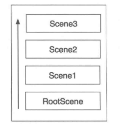

# 核心框架

## 导演

### 设置帧率

帧率是用于测量显示帧数到量度，其单位为“每秒显示帧数”（Frame per Second, FPS）。一般情况下，电影以 **24fps** 播放，而在游戏中如果帧率低于 **30fps** 的话，游戏就会显得卡顿不连贯。在 Cocos2d-JS 中，帧率默认为 **60fps**。若想修改默认帧率，可以直接修改工程下 project.json 文件中 frameRate 的值。

在游戏运行中，`cc.Director` 也提供了动态操作帧率的 API，你可以调用 `cc.director.setAnimationInterval(fps)` 方法来更改帧率。**需要注意的是，这里的参数 fps 是帧率的倒数，表示游戏每秒绘制多少次**

```javascript
cc.director.setAnimationInterval(1.0 / 60);
```

### 初始化管理器

导演好比一艘船的船长，是整个游戏的统筹。它需要一些帮手来分担任务。这些帮手就是调度器、动作管理器、事件管理器。这些管理器，对应管理着自己的领域，它们都在 `cc.Director` 的 `init()` 方法中被初始化。

```javascript
// frameworks/cocos2d-html5/cocos2d/core/CCDirector.js
cc.Director = cc.Class.extend(/** @lends cc.Director# */{
    init: function () {
        //scheduler
        this._scheduler = new cc.Scheduler();
        //action manager
        if (cc.ActionManager) {
            this._actionManager = new cc.ActionManager();
            this._scheduler.scheduleUpdate(this._actionManager, cc.Scheduler.PRIORITY_SYSTEM, false);
        } else {
            this._actionManager = null;
        }

        this._eventAfterUpdate = new cc.EventCustom(cc.Director.EVENT_AFTER_UPDATE);
        this._eventAfterUpdate.setUserData(this);
        this._eventAfterVisit = new cc.EventCustom(cc.Director.EVENT_AFTER_VISIT);
        this._eventAfterVisit.setUserData(this);
        this._eventAfterDraw = new cc.EventCustom(cc.Director.EVENT_AFTER_DRAW);
        this._eventAfterDraw.setUserData(this);
        this._eventProjectionChanged = new cc.EventCustom(cc.Director.EVENT_PROJECTION_CHANGED);
        this._eventProjectionChanged.setUserData(this);

        return true;
    }
```

### 初始化渲染器

渲染器用于将图片或者 3D 模型素材绘制到屏幕上。因为 Cocos2d-JS 是一个跨全平台的游戏引擎，使用它开发出来的游戏可以运行在浏览器和本地上，所以，在各平台上采用的渲染器也是不一样的。

在 HTML5 中，iOS 8 以上以及所有 PC 系统中，默认采用 **WebGL** 渲染，其他浏览器采用 **canvas** 绘制，例如 Android 手机上的浏览器。

在 Native 上，全部采用 **OpenGL ES 2.0** 渲染。

### 获取屏幕大小

在游戏开发中，时常需要获取当前屏幕大小，然后参考屏幕的大小将游戏中的可视对象定位在屏幕上。`cc.Director` 提供了几种不同概念的屏幕大小。

```javascript
cc.Diretor = cc.Class.extend({
    getWinSize: function () {
        return cc.size(this._winSizeInPoints);
    },
    getWinSinzeInPixels: function () {
        return cc.size(this._winSizeInPoints.width * this._contentScaleFactor, this._winSizeInPoints.height * this._contentScaleFactor);
    },
    getVisibleSize: null,
    getVisibleOrigin: null
});
```

其中 `WinSize` 表示实际画布的大小，`VisibleSize` 表示可视区域的大小，所以，`VisibleSize` 总是小于或者等于 `WinSize`。值得注意的是，`VisibleSize` 和 `VisibleOrigin` 是为 Native 服务的，仅在 JSB 上有效。另外，在 CCBoot.js 中实现了这样一行代码：

```javascript
cc.winSize = cc.director.getWinSize();
```

因此，你可以通过 `cc.winSize` 的方式快速获取屏幕的大小。

### 执行游戏主循环

当游戏的底层环境设置好之后，游戏就可以以设定好的帧率（默认为 60fps）进入主循环了。cc.Director 定义了一个 `mainLoop` 方法，该方法控制着整个游戏的主循环。你可以在 `CCDirector.js` 中看到这样一段代码：

```javascript
cc.Director = cc.Class.extend({
    mainLoop: function () {
        if (this._purgeDirectorInNextLoop) {
            this._purgeDirectorInNextLoop = false;
            this.purgeDirector();
        } else if (!this.invaild) {
            this.drawScene();
        }
    }
});
```

- **是否需要清除自身**：首先，cc.Director 会去检查下一帧是否需要清除自身，一般在调用 cc.director.end() 时触发，这将清理和退出正在运行的场景，并且取消所有的调度器，删除所有的事件监听器，停止所有的动画以及清空缓存数据。
- **开始绘制场景**：然后，开始绘制场景，Cocos2d-JS 首先会去计算增量时间，即上一帧到现在所花的时间。理论上，它的值总是大于或者等于游戏设定的帧率的倒数。**所以，增量时间越大，游戏越显得卡顿。当增量时间大于一定值的时候，游戏开始出现明显的掉帧现象。**
- **执行调度器**：接着 cc.Director 开始执行调度器中所被要求执行的任务。例如，《飞机大战》游戏中的飞机每隔 0.5s 发射子弹，若游戏以 60fps 来绘制，它大概是每隔 30 帧创建一颗子弹出来。若当前帧与上一次发射子弹刚好间隔了 30 帧，那这一次的子弹就会在当前帧被创建出来。
- **触发 cc.director.EVENT_AFTER_UPDATE 事件**：在执行调度器中的任务之后，cc.Director 通过事件管理器触发 cc.director.EVENT_AFTER_UPDATE 事件，然后 Cocos2d-JS 开始检查是否有用户交互事件触发，例如触摸事件、鼠标实现、键盘事件、重力感应事件以及自定义事件，若有，则分发和处理这些事件。
- **绘制节点**：事件分发完毕之后，渲染器把整个屏幕都清空掉，这是非常合理的。因为当渲染器清空完屏幕之后，导演开始判断是否有场景需要切换，若有，则切换到下一个场景，若没有，则遍历当前场景中的节点并更新节点的空间转换矩阵等信息，然后发送绘制指令给渲染器。接着，cc.Director 触发 cc.director.EVENT_AFTER_VISIT 事件，并且会把所有的字节点**按照层级从小到大进行排序**，排序之后，所以字节点的 `visit()` 方法将被触发。也正是在这个方法中，节点被绘制出来。
- **更新当前帧率**：节点绘制完毕后，cc.Director 触发 cc.director.EVENT_AFTER_DRAW 事件，最终更新当前帧率。

## Cocos2d-JS 坐标系

渲染器渲染游戏对象时，需要获取游戏对象的位置。

在手机移动应用中，坐标系通常分为两种——屏幕坐标系和 OpenGL 坐标系。传统的原生应用采用的是屏幕坐标，即以屏幕的左上角为原点，向右表示 X 轴的正方向，向下表示 Y 轴的正方向，这不管是在 iOS、Android 还是   Windows Phone 中，都是一样的。

然而，Cocos2d-JS 并不是采用屏幕坐标系，而是选择了和 OpenGL 保持一致，即以屏幕的左下角为原点，向右表示 X 轴的正方向，向上表示 Y 轴的正方向。


另外，cc.Director 提供了屏幕坐标和 OpenGL 坐标二者之间互相转换的方法

```javascript
convertToGL = function (uiPoint)		// 转换 UI 坐标为 OpenGL/WebGL 坐标
convertToUI = function (glPoint)		// 转换 OpenGL/WebGL 坐标为 UI 坐标
```

除此之外，Cocos2d-JS 中还有世界坐标系和本地坐标系的概念。

## 节点

节点，是一个代词，它是一个抽象概念类，在 Cocos2d-JS 中为 `cc.Node` 类。也就是说，所有 cc.Node 类及其子类，都可以归称为节点。cc.Node 本身没有可视化表示形式，但凡是能被绘制，或者能包含其他节点的东西都是节点，例如场景（cc.Scene）、层（cc.Layer）、精灵（cc.Sprite）等。所有的节点都继承自 cc.Node，cc.Node 定义了所有节点共有的属性和方法。

### 基础属性

#### 位置

位置是节点最基础的属性，默认为 cc.p(0, 0)，大部分的节点你我们都需要给它设置一个位置。

位置相关的 API：

| 属性      | 对应方法                            | 参数或返回类型       | 说明                |
| --------- | ----------------------------------- | -------------------- | ------------------- |
| x         | setPositionX(posX)                  | Number               | 设置节点的 X 轴坐标 |
|           | getPositionX()                      | Number               | 获取节点的 X 轴坐标 |
| y         | setPositionY(posY)                  | Number               | 设置节点的 Y 轴坐标 |
|           | getPositionY()                      | Number               | 获取节点的 Y 轴坐标 |
| _position | setPosition(newPosOrxValue, yValue) | cc.p(x, y) 或 Number | 设置节点的坐标      |
|           | getPosition()                       | Number               | 获取节点的坐标      |

**属性前面带有下划线（_）的，均表示私有属性，子类不可访问，例如 cc.Node 的 _position 属性。**

```javascript
// 通过属性方式
node.x = 100; // 设置 x 轴坐标
node.y = 86; // 设置 y 轴坐标
var posX = node.x; // 获取 x 轴坐标
var posY = node.y; // 获取 y 轴坐标

// 通过方法形式
node.setPosition(100, 86); // 设置坐标
node.setPosition(cc.p(100, 86)); // 设置坐标
node.getPosition(); // 获取坐标，返回 cc.p 类型

```

Cocos2d-JS 提供了两种操作属性的方法，第一种是直接通过属性风格操作属性，第二种是通过函数调用。虽然通过属性操作的方式更加简便，但是属性风格的实现用到 ECMAScript 的 getter 和 setter 的特性，**这两个特性在部分浏览器上面的效率要低于方法**，所以在对性能要求比较高的地方还是建议使用方法进行访问。

> cc.defineGetterSetter(proto, prop, getter,setter) 函数实现了 ECMAScript 的 getter 和 setter 特性，你可以在 cocos2d-x/cocos/scripting/js-bindings/script/jsb_boot.js （Native 实现）或 cocos2d-x/web/cocos2d/core/platform/CCClass.js（web 实现）中看到它的实现。

#### 大小

在开发中，可能需要设置或获取节点的大小，例如在做碰撞检测的时候。

节点大小的相关 API：

| 属性         | 对应方法                     | 参数或返回类型     | 说明               |
| ------------ | ---------------------------- | ------------------ | ------------------ |
| _contentSize | setContentSize(size, height) | Number             | 设置节点的内容大小 |
|              | getContentSize()             | cc.size() 数据结构 | 获取节点内容大小   |

```javascript
// 通过属性的方式快速访问节点的大小值
node.width = 100; // 设置节点的宽度
node.height = 200; // 设置节点的高度
var width = node.width; // 获取节点的宽度
var height = node.height; // 获取节点的高度
```

**值得注意的是，这里设置的内容大小并不会改变节点的视觉效果，它只是一个属性，一般也被用到触摸事件中。**

> cocos2d-x/web/cocos2d/core/base-nodes/BaseNodes/PropertyDefine.js 实现了节点的属性访问方式，例如 node.height 的实现如下：
>
> ```javascript
> var _p = cc.Node.prototype;
> _p.height;
> cc.defineGetterSetter(_p, "height", _p._getHeight, _p.setHeight);
> ```
>
> 除此之外，其他类的属性方式也是这样实现的。

#### 锚点

锚点，它是一个百分比系数，其取值范围为[0, 0] 到 [1, 1]，边界包含 0 和 1。每种类型的节点都会有自己的默认值，例如 cc.Node 类的默认节点为 cc.p(0, 0)，表示节点的左下角定位在屏幕上你所设定的位置。所以，位置和锚点这两个属性共同决定了节点在屏幕中的摆放位置。

```javascript
node.setAnchorPoint(0.5, 0.5); // 设置锚点
var anchor = node.getAnchorPoint(); // 获取锚点，返回 cc.p 类型
```

节点定位在屏幕上的定位点（称为原点）的算法：

> x 轴坐标：节点宽度 * 锚点 x 值
>
> y 轴坐标：节点高度 * 锚点 y 值

也可以通过 cc.Node 的 `getAnchorPointInPoints()` 函数直接获取原点。

除此之外，锚点还决定节点变换操作，例如旋转和缩放等。因为动作是基于变换操作的，所以锚点也是动作运转的围绕点。

#### 层级

若当游戏中只有一个节点，渲染器可以直接对此节点进行绘制。但是，倘若游戏中有两个以上的节点需要绘制，那么渲染器可能会不知所措，因为它并不知道要将哪个节点绘制在屏幕的最上方，哪个节点绘制在屏幕的最下方。所以，每个节点都会有一个层级属性，用来告诉渲染器节点的绘制顺序。

层级又分为全局层级和本级层级两种，全局层级用 globalZOrder 表示，本地层级用 localZOrder 表示，全局层级的绘制优先级高于本地层级。

获取和设置层级的相关 API ：

| 属性          | 对应方法                      | 参数或返回类型 | 说明               |
| ------------- | ----------------------------- | -------------- | ------------------ |
| zIndex        | setLocalZOrder(localZOrder)   | Number         | 设置节点的本地层级 |
|               | getLocalZOrder()              | Number         | 获取节点的本地层级 |
| _globalZOrder | setGlobalZOrder(globalZOrder) | Number         | 设置节点的全局层级 |
|               | getGlobalZOrder()             | Number         | 获取节点的全局层级 |

一般情况下，层级保持默认值即可。在开发中，能少用层级的就尽量少用层级，免得节点层级关系乱七八糟点，给自己带来麻烦。若在一些非用层级不可的地方，那么建议定义一个类似枚举的层级对象，向下面那样：

```javascript
var NodeZorder = NodeZorder || {};
NodeZorder.HERO = 100; // 角色对象层级
NodeZorder.ROLE = 200; // 角色对象层级
// ...
this.addChild(node, NodeZorder.HERO); // 将节点添加到当前层中
```

#### 标签

在游戏中可能同时存在好多个节点，你可以为每个节点都贴上一个标签，方便区分它们。cc.Node 提供了一个叫 tag 的属性，默认值为 -1， 是 Number 类型。

设置和获取节点 tag 值的 API ：

| 属性 | 对应方法    | 参数或返回类型 | 说明           |
| ---- | ----------- | -------------- | -------------- |
| tag  | setTag(tag) | Number         | 设置节点的标签 |
|      | getTag()    | Number         | 获取节点的标签 |

*注意：cc.Node 的 tag 值必须为整型，否则在 JSB 上会报错，这是因为 Cocos2d-x API 设计的就是整型的。*

#### 名字

用 tag 标记节点的方式可能不能完全满足开发需求。因为 tag 为整型类型，虽然我们可以通过定义常量的方式将 tag 值中转一下，但是若 tag 值相等的话，节点依旧无法根据 tag 值区分，就像下面这样：

```javascript
MAN = 1;
WOMAN = 1;
var man = new cc.Node(); // 创建节点
man.setTag(MAN);	// 设置 tag 属性
var woman = new cc.Node(); // 创建节点
woman.setTag(WOMAN); // 设置 tag 属性
```

所以，Cocos2d-JS 也为节点设计了 name 属性，它是字符串类型的。

name 属性对应的方法

| 属性 | 对应方法      | 参数或返回类型 | 说明           |
| ---- | ------------- | -------------- | -------------- |
| name | setName(name) | String         | 设置节点的名字 |
|      | getName()     | String         | 获取节点的名字 |

### 图形属性

#### 旋转

引擎为节点设计了 `rotation` 属性来控制节点的旋转角度，其默认值为 0，它是 Number 类型的。另外，值得说明的是，在 Cocos2d-JS 的坐标系中，垂直 X 轴向上表示 0<sup>o</sup>，垂直 Y 轴向右为 90<sup>o</sup>，rotation 的值为正数表示顺时针旋转，负数表示逆时针旋转。

旋转相关的属性：

| 属性      | 对应方法            | 参数或返回类型 | 说明                    |
| --------- | ------------------- | -------------- | ----------------------- |
| rotation  | setRotation(angle)  | Number         | 设置节点的旋转角度      |
|           | getRotation()       | Number         | 获取节点的旋转角度      |
| rotationX | setRotationX(angle) | Number         | 设置节点 X 轴的旋转角度 |
|           | getRotationX()      | Number         | 获取节点 X 轴的旋转角度 |
| rotationY | setRotationY(angle) | Number         | 设置节点 Y 轴的旋转角度 |
|           | getRotationY()      | Number         | 获取节点 Y 轴的旋转角度 |

#### 缩放

和旋转类似，你可以通过节点的 `scale` 属性来控制节点渲染时的缩放比例，即视觉上节点的大小。它的取值范围是 R（全体实数），默认值为 1。设置为负数的话，引擎将会反向渲染显示。例如要水平翻转，只需要调用 `setScaleX(-1)` 即可。

缩放相关的属性：

| 属性   | 对应方法         | 参数或返回类型 | 说明                    |
| ------ | ---------------- | -------------- | ----------------------- |
| scale  | setScale(radio)  | Number         | 设置节点的缩放倍数      |
|        | getScale()       | Number         | 获取节点的缩放倍数      |
| scaleX | setScaleX(radio) | Number         | 设置节点 X 轴的缩放倍数 |
|        | getScaleX()      | Number         | 获取节点 X 轴的缩放倍数 |
| scaleY | setScale(radio)  | Number         | 设置节点 Y 轴的缩放倍数 |
|        | getScaleY()      | Number         | 获取节点 Y 轴的缩放倍数 |

#### 倾斜

除了旋转和缩放之外，引擎还提供 `skew` 属性来控制节点的倾斜度。

skew 属性的对应 API:

| 属性  | 对应方法       | 参数或返回类型 | 说明                  |
| ----- | -------------- | -------------- | --------------------- |
| skewX | setSkewX(skew) | Number         | 设置节点的 X 轴倾斜度 |
|       | getSkewX()     | Number         | 获取节点的 X 轴倾斜度 |
| skewY | setSkewY(skew) | Nunber         | 设置节点的 Y 轴倾斜度 |
|       | getSkewY()     | Number         | 获取节点的 Y 轴倾斜度 |

#### 可见性

节点的 `visible` 属性就是用来控制节点对象是否可见的，当 visible 值为 false 时，引擎将不会对该节点进行渲染。

visible 属性对应的 API：

| 属性    | 对应方法              | 参数或返回类型 | 说明             |
| ------- | --------------------- | -------------- | ---------------- |
| visible | setVisible(isVisible) | Boolean        | 设置节点是否可见 |
|         | isVisible()           | Boolean        | 获取节点是否可见 |

#### 不透明

在游戏内部需要实现一些半透明效果，节点的 `opacity` 属性就是为此设计的。它的取值区间是[0, 255]，0 表示全透明。另外，`cascadeOpacity` 属性可以控制 opacity 是否进行子节点关联，使 opacity 值也作用于其子节点上。

opacity 属性对应的 API：

| 属性           | 对应方法                             | 参数或返回类型 | 说明                 |
| -------------- | ------------------------------------ | -------------- | -------------------- |
| opacity        | setOpacity(opacity)                  | Number         | 设置不透明度         |
|                | getOpacity(opacity)                  | Number         | 获取不透明度         |
| cascadeOpacity | setCascadeOpactiry(isCascadeOpacity) | Boolean        | 设置是否级联不透明度 |
|                | isCascadeOpacity()                   | Boolean        | 获取是否级联不透明度 |

 **和设置可见性不同，设置节点透明度为 0 后，节点虽然看不到了，但这只是进行透明度混合运算的结果，引擎还是会渲染该节点。**

#### 颜色

节点的 color 属性可以设置节点显示的颜色，参数为 `cc.color` 对象。cc.color 接收一个 RGB 参数。

cascadeColor 属性表示是否进行子节点关联，即是否使当前节点的颜色值也作用到其子节点上。

opacityModifyRGB 属性用于指定颜色值是否要跟着不透明度进行改变。

颜色相关的属性对应 API：

| 属性             | 对应方法               | 参数或返回类型 | 说明                             |
| ---------------- | ---------------------- | -------------- | -------------------------------- |
| color            | setColor(color)        | cc.color       | 设置节点的颜色                   |
|                  | getColor()             | cc.color       | 获取节点的颜色                   |
| cascadeColor     | setCascadeColor(b)     | Boolean        | 设置是否级联颜色值               |
|                  | isCascadeColor()       | Boolean        | 获取是否级联颜色值               |
| opacityModifyRGB | setOpacityModifyRGB(b) | Boolean        | 设置颜色是否跟随不透明度进行改变 |
|                  | isOpacityModifyRGB()   | Boolean        | 获取颜色是否跟随不透明度进行改变 |

#### 渲染程序

在游戏里面有的时候需要用到一些渲染特效，这些特效通常是一些 shader（着色器）程序，节点的 `shaderProgram` 属性就是因此而生的。

shaderProgram 属性相关的 API：

| 属性          | 对应方法             | 参数或返回类型 | 说明                 |
| ------------- | -------------------- | -------------- | -------------------- |
| shaderProgram | setShaderProgram(sp) | cc.GLProgram   | 设置节点的着色器程序 |
|               | getShaderProgram()   | cc.GLProgram   | 获取节点的着色器程序 |

### 其他属性

除了以上属性之外， Cocos2d-JS 还为 cc.Node 提供了其他属性，比如父/子节点相关属性、running 属性、actionManager 属性、arrivalOrder 属性等。

#### 父/子节点相关

引擎中层（Layer）通常包含其他等节点，同时层又添加到场景（Scene）里面，这样它们便有里父子关系，场景是层的父节点，其他添加到层里面到节点就是层到字节点。节点到 parent 属性表示的就是该节点的父节点对象，而 children 属性表示的就是当前节点的所有子节点的一个集合，childrenCount 属性表示当前节点拥有的子节点数量。

父/子节点相关到 API：

| 属性          | 对应方法              | 参数或返回类型 | 说明                   |
| ------------- | --------------------- | -------------- | ---------------------- |
| parent        | setParent(parentNode) | cc.Node        | 设置父节点对象         |
|               | getParent()           | cc.Node        | 获取父节点对象         |
| children      | getChildren()         | Array          | 获取所有子节点对象集合 |
| childrenCount | getChildrenCount()    | Number         | 获取子节点数量         |

**children 属性和 childrenCount 属性是只读属性，节点到子节点只能通过 addChild() 方法添加，在添加的同时 childrenCount  属性会自动计数。**

#### 运行状态

节点的 `running` 属性用于判断该节点是否处于运行状态。当节点的生命周期进入 onEnter 时，running 的值为 true；当节点的生命周期进入 onExit 时，running 的值为 false。

running 属性对应的 API：

| 属性    | 对应方法  | 参数或返回类型 | 说明                     |
| ------- | --------- | -------------- | ------------------------ |
| running | isRunning | Boolean        | 判断节点是否处于运行状态 |

#### 动作管理器

每个节点都会有一个动作管理器来管理节点的动作，actionManager 属性表示的就是当前节点的动作管理对象。

actionManager 属性对应的 API：

| 属性          | 对应方法             | 参数或返回类型   | 说明                 |
| ------------- | -------------------- | ---------------- | -------------------- |
| actionManager | setActionManager(am) | cc.ActionManager | 设置节点的动作管理器 |
|               | getActionManager()   | cc.ActionManager | 获取节点的动作管理器 |

#### 到达顺序

引擎在绘制节点对象的时候会根据层级进行排序，但是有的节点的层级是相同的，而 `arrivalOrder` 属性就是用来对层级相同的节点进行排序的。arrivalOrder 值**越小**的节点将被引擎优先渲染。该属性属于引擎内部使用，不建议修改。

arrivalOrder 属性对应的 API：

| 属性         | 对应方法                 | 参数或返回类型 | 说明               |
| ------------ | ------------------------ | -------------- | ------------------ |
| arrvialOrder | setOrderOfArrival(order) | Number         | 设置节点的到达顺序 |
|              | getOrderOfArrival()      | Number         | 获取节点的到达顺序 |

### 常用函数

#### 属性配置

cc.Node 提供了 `attr()` 函数供开发者快速配置属性

```javascript
node.attr({
    x: 200, // 设置节点的 x 轴坐标
    y: 300, // 设置节点的 y 轴坐标
    scale: 1.5, // 设置节点的缩放比例
    rotaion: 45 // 设置节点的旋转角度
});
```

#### 节点的操作

操作节点的大概有“增、删、改、查” 4 个功能。

- 增

  当创建好一个节点之后，你可以把它添加到父节点中

  ```javascript
  // child 为子节点，localZOrder 为本地层级，默认值为 0，可以省略，tag 为标签，默认值为 -1，可以省略
  addChild(child, localZOrder, tag);
  ```

- 删

  cc.Node 提供了 4 个删除节点的相关 API:

  ```javascript
  // 这 4 个 API 的 cleanup 参数都是布尔值，表示是否清除节点中所有的动作以及回调函数，默认值为 true，可以省略
  parent.removeChild(child, cleanup); // 删除子节点
  parent.removeChildByTag(tag, cleanup); // 根据 tag 删除子节点
  parent.removeAllChildren(cleanup); // 删除所有子节点
  node.removeFromParent(cleanup); // 子节点自己从父节点删除
  ```

- 改

  这里的改，实际上是重新对节点的 `arrivalOrder` 和 `localZOrder` 进行赋值。与 node.setLocalZOrder(localZOrder)函数不同的是，它对 arrivalOrder 属性也重新赋值了。所以，理论上若你想对节点赋予一个新的渲染顺序，通过下面的方法会更好一些。

  ```javascript
  parent.reorderChild(child, zOrder);
  ```

- 查

  通过 tag 和 name 属性，便可以在父节点中找到想要的子节点

  ```javascript
  node.getChildByTag(tag);
  node.getChildByName(name);
  ```

  除此之外，cc.Node 还提供了返回子节点数组以及子节点个数的 API：

  ```javascript
  node.getChildren(); // 获取所有子节点，返回一个数组
  node.getChildrenCount(); // 获取子节点个数
  ```

#### 暂停和恢复

通过 cc.Node 的 pause() 和 resume() 函数，可以暂停和恢复节点的动作以及调度器，这一般用在暂停游戏和恢复游戏的功能上。可以把需要暂停和恢复的节点放在一个数组中，然后遍历这个数组，再调用数组中节点的 pause() 和 resume() 函数即可。

```javascript
node.pause(); // 暂停节点的动作以及调度器
node.resume(); // 恢复节点的动作以及调度器
```

#### 动作操作

每一个节点都可以运行动作，cc.Node 提供了如下和动作相关的 API：

```javascript
node.runAction(action); // 运行指定动作
node.stopAction(action); // 停止指定动作
node.stopAllAction(); // 停止所有动作
node.stopActionByTag(99); // 根据动作的 tag 值停止动作
var action = node.getActionByTag(99); // 根据 tag 值在动作列表中取出动作
```

#### 内存管理

Cocos 游戏引擎采用的内存管理方式是**自动垃圾回收**的方式。也就意味着你并不需要自动手动管理对象的内存。

Cocos 引擎采用的内存管理机制实际上来源于 Mac OS X 10.7 与 iOS 5 中引入的一项新技术—— ARC，中文译为自动引用计数，是 Automatic Reference Counting 的缩写。ARC 在 Cocos2d-x 中的原理大概是这样：

>在 Cocos2d-x 中，每个对象都有一个 `_referenceCount` 属性，该对象被引用时，\_referenceCount 会执行 +1 操作，例如调用 node.addChild(child) 函数。当对象被释放时，\_referenceCount 会执行 -1 操作，例如调用 node.removeChild(child) 函数。在每一帧绘制完成后，对象池（AutoreleasePool）会去检查回收池中所有对象的 \_referenceCount 值，当对象的 \_referenceCount 值为 0 时，对象回收池便会回收释放内存。

虽然 Cocos 引擎提供了自动内存回收的机制，但是你仍然可以通过如下 API 管理内存。它们仅在 JSB 中有效。

```javascript
node.retain(); // 使节点的引用计数（_referenceCount）加 1
node.release(); // 使节点的引用计数（_referenceCount）减 1
```

#### 调度器

在开发中，你可能需要游戏每隔一段时间做某一件事情，比如每隔 0.1s 发射一颗子弹，这样的需求就需要调度器来实现。cc.Node 为调度器提供了相关的 API，你可以通过如下代码开启默认调度器

```javascript
node.scheduleUpdate();
node.update = function (dt) {
    cc.log("每一帧都会执行，每一帧事件间隔为：", dt);
}
// 当一个节点调用 scheduleUpdate() 函数之后，你必须重写此节点的 update(dt) 函数。在 update(dt) 中，dt 参数表示时间间隔，一般为每一帧时间。你可以用它做一个计时器，在帧率为 60fps 的情况下，执行了 60 次的 update 函数，就是 1 秒了。

// 此外，可以通过 schedule 函数启动一个自定义调度器
node.schedule(callback, interval, repeat, delay, key);
// callback 为调度器的回调函数，是 function 类型。interval、repeat 和 delay 分别表示时间间隔、重复次数、延时时间，都是 Number 类型；key 为 String 类型，是调度器的唯一标识符。
// 除了 callback 之外，其余参数都是可省略的，这说明它们都有一个默认值。inteval 的默认值为 0，如果省略，应该考虑使用默认的 update(dt) 调度器。repeat 的默认值为 cc.REPEAT_FOREVER，是一个正无穷数，表示无限循环。delay 的默认值为 0
callback = function () {
    cc.log("自定义定时器。。。每隔 0.2s 执行一次。。。");
};
node.schedule(callback, 0.2);

//cc.Node 还提供了只调度一次的调度器，其参数和用法都与 schedule 函数一致
node.scheduleOnce(callback, delay, key);

// 除此之外，cc.Node 拥有两个卸载调度器的函数，一个是卸载指定调度器，一个是卸载所有调度器
node.unschedule(callback); // 卸载 callback 调度器，callback 即调度器回调函数
node.unsceduleAllCallbacks(); // 卸载 node 节点所有的调度器
```

#### 坐标转换

Cocos2d-JS 中有**本地坐标**和**世界坐标**的概念，本地坐标指的是以父节点的左下角为原点的坐标参考系，而世界坐标以标准的 Cocos2d-JS 坐标系作为参考系。例如，当前游戏中有 Node_A 和 Node_B 两个精灵节点（因为精灵节点的默认锚点是 cc.p(0.5, 0.5)，所以精灵节点的原点在其自身的正中心），它们的大小都是 cc.size(200, 200)，Node_B 是 Node_A 的子节点。Node_A 的坐标为 cc.p(200, 200)，Node_B 的坐标为 cc.p(100, 100)，那么它们在游戏中的坐标位置如图


cc.Node 提供了本地坐标和世界坐标转换的相关代码

```javascript
// 本地坐标转为世界坐标
var toWorldPos = nodeParent.convertToWorldSpace(node.getPosition());
// 本地坐标转为世界坐标（受锚点影响）
var toWorldPosAR = nodeParent.convertToWorldSpaceAR(node.getPosition());
// 世界坐标转换为本地坐标
var toNodePos = node_A.convertToNodeSpace(node_B);
// 世界坐标转为本地坐标（受锚点影响）
var toNodePosAR = node_A.convertToNodeSpaceAR(node_B);
```

#### 边框区域

cc.Node 提供了两个和边框区域有关的 API：

```javascript
node.getBoundingBox();	// 返回节点的本地坐标系的外边框
node.getBoundingBoxToWorld();	// 返回节点的世界坐标系的边框
// 它们的返回值都是一个 cc.rect(x, y, width, height) 的数据结构，其中 x、y 分别表示节点的 x 轴和 y 轴的坐标，width 和 height 表示节点的宽度和高度。
```

## 场景

在 Cocos2d-JS 游戏中，至少存在一个场景供游戏运作。先来看看 `cc.Scene`  的构造函数

```javascript
cc.Scene = cc.Node.extend({
    _className: "Scene",
    ctor: function () {
        cc.Node.prototype.ctor.call(this); // 调用父类构造函数
        this._ignoreAnchorPointForPosition = true; // 设置忽略锚点
        this.setAnchorPoint(0.5, 0.5); // 设置锚点
        this.setContentSize(cc.director.getWidthSize()); // 设置大小
    }
});
```

从上面的代码不难发现，场景（cc.Scene）类十分简单，它只是作为层（cc.Layer）的容器。从第 5 行代码可以看到，场景有忽略锚点属性，默认值为 true。虽然在第 6 行代码中，锚点被设置为 (0.5, 0.5)，但是这已经没有什么用了，因为锚点已经被忽略了。通常情况下不应该去更改场景的锚点和忽略锚点的值，它只是提供给引擎自己使用的。

### 再探导演——场景管理

作为层的容器，场景可以添加层，但是不能再添加场景。场景与场景的切换，只能通过 `cc.Director` 来实现。使用 cc.Director 管理场景的相关方法如下：

```javascript
cc.Director = cc.Class.extend({
    getRunningScene: function(); // 获取正在运行的场景
    runScene: function(scene); // 运行指定场景
    pushScene: function(scene); // 压入指定场景
    popScene: function(); // 弹出顶部场景
    popToRootScene: function(); // 弹出到根场景
    popToSceneStackLevel: function(level); // 弹出到指定栈场景
});
```

cc.Director 提供了一个 getRunningScene() 方法，让你在任何地方都可以获取到当前正在运行的场景。

cc.Director 只提供了一种方法从一个场景切换到另一个场景，这和 Cocos2d-x 显得有些出入。Cocos2d-x 首次运行场景用 runWithScene()，场景和场景之间的切换通过 replaceScene() 方法替换，而 Cocos2d-JS 废弃了 runWithScene() 和 replaceScene() 方法，简化了场景的管理，所有场景之间的切换都采用 runScene() 方法。

另外，cc.Director 还提供了栈来管理场景



通常情况下，pushScene 用来压入一些占用内存比较小的场景。这是因为 pushScene 会终止当前正在运行的场景，并且把它放入到场景栈中，将它“冷藏”起来，然后才运行新的场景，当前的场景并没有被释放掉。因此，一般应该选择压入游戏设置等这一类占用内存较小的场景，但如果你压入的场景所使用的内存过大，则可能引起设备内存不足，Cocos2d-JS 发现内存不足，则会释放被“冷藏”起来的场景中所用到的资源所占的内存，这将造成不可控制的危害。

pop 相关操作场景的方法大同小异，都是将经过 pushScene 的场景从堆栈（内存）中 pop 出来执行，但前提是堆栈内存在此场景，而当前执行的场景将被删除。

### 切换特效

场景之间的切换，Cocos2d-JS 提供了大几十种的过渡效果，例如四方推入、淡入淡出等。

```javascript
// 四方推入
cc.director.runScene(new cc.TransitionMoveInL(time, scene)); // 从左往右推入
cc.director.runScene(new cc.TransitionMoveInR(time, scene)); // 从右往左推入
cc.director.runScene(new cc.TransitionMoveInT(time, scene)); // 从上往下推入
cc.director.runScene(new cc.TransitionMoveInB(time, scene)); // 从下往上推入

// 淡入淡出
cc.director.runScene(new cc.TransitonFade(time, scene));
```

其中，参数 time 是过渡时长，scene 为目标场景。

### 场景的生命周期

在 Cocos2d-JS 引擎中，游戏场景在运行的过程中会经历几个不同的阶段，这些阶段就是我们所说的生命周期。每一个阶段皆表示场景的一个状态，每个状态都有不同的表现。场景从构造到最终显示在屏幕上，再到场景销毁以及退出经历了以下几个阶段：

```javascript
var MainMenuScene = cc.Scene.extend({
    ctor: function () { // 构造函数
        // TODO something
    },
    onEnter: function () { // 场景进入
        this._super();
        // TODO something
    },
    onEnterTransitonDidFinish: function () { // 场景进入过渡效果执行完毕
        this._super();
        // TODO something
    },
    onExitTransitionDidStart: function () { // 场景退出过渡效果开始执行
        // TODO something 
        this._super();
    },
    onExit: function () { // 场景退出
        // TODO something
        this._super();
    }
});
```

其中，this._super() 函数为调用父类的当前方法。值得注意的是，在退出相关的生命周期函数中，应该将 this._super() 函数放在最后调用，遵循“先进后出”的原则。

当两个场景进行切换的时候，整个过程的生命周期变化顺序如下（其中 SceneA 为当前场景，SceneB 为即将切换过去的场景）：

> SceneA: ctor
>
> SceneA: onEnter
>
> SceneA: onEnterTransitionDidFinish
>
> SceneB: ctor
>
> SceneA: onExitTransitonDidStart
>
> SceneA: onExit
>
> SceneB: onEnter
>
> SceneB: onEnterTransitonDidFinish

可以看到，Cocos2d-JS 会先调用 SceneB 的 ctor 构造函数，然后继续调用 SceneA 的 onExitTransitionDisStart 和 onExit 函数，最后在 SceneB 的 onEnter 函数中将 SceneB 渲染出来。不难发现，SceneB 的 ctor 构造函数是两个场景切换的关键所在，它是两个场景切换时的临界点，所以，不应该在场景的 ctor 函数中做一些对内存开销大的操作（例如加载资源等），这会导致两个场景的资源都被加载到内存，从而可能导致内存不足，引起程序崩溃。

## 层

层是一个容器，它最大的作用就是管理场景中的节点。层一般作为场景的子节点，当然，它也可以作为其他节点的子节点，进一步管理子节点的子节点，但这并不多见。下面为 cc.Layer 的构造函数：

```javascript
cc.Layer = cc.Node.extend({
    _className: "Layer"
})
```

从上述代码的第 6 行到第 8 行可以得到，层的一些默认设置和场景一样的，也是默认忽略锚点，锚点为(0.5, 0.5)，且大小为当前屏幕的大小。

实际上，Cocos2d-JS 提供了 4 中层，cc.Layer 只是其中最基本的一种。除此之外，其他 3 种层分别是 cc.LayerColor、cc.LayerGradient 和 cc.LayerMultiplex。值得注意的是，它们都继承 cc.Layer。

### cc.LayerColor

cc.LayerColor 作为一个可以携带颜色的层，在平常开发中非常常用，例如游戏中的 Dialog 模态对话框中背景半透明变暗的实现。通常，他们会创建一个 cc.LayerColor，指定颜色为 cc.color(0, 0, 0, 138)，大小为当前屏幕的大小。

```javascript
var width = cc.winSize.width; // 获取屏幕宽度
var height = cc.winSize.height; // 获取屏幕高度
var dialog = new cc.LayerColor(cc.color(0, 0, 0, 138), width, height);
this.addChild(dialog);
```

实际上，上述第 3 行代码传递进去的 width 和 height 是可省略的，这可以从 cc.LayerColor 中的 init  方法中找到答案：

```javascript
cc.LayerColor = cc.Layer.extend({
    _blendFunc: null,
    _className: "LayerColor",
    // ...
    init: function (color, width, height) {
        var winSize = cc.director.getWinSize();
        color = color || cc.color(0, 0, 0, 255);
        widht = widht === undefined ? winSize.width : width;
        height = height === undefined ? winSzie.height : height;
        
        var locRealColor = this._realColor;
        locRealColor.r = color.r;
        locRealColor.g = color.g;
        locRealColor.b = color.b;
        this._realOpacity = color.a;
        this._renderCmd.setDirtyFlag(cc.Node._dirtyFlags.colorDirty cc.Node._dirtyFlags.opactiry);
        
        cc.LayerColor.prototype.setContentSize.call(this, width, height);
        return true;
    }
    // ...
})
```

在上面代码的第 10 行中可以看到，若你在创建 cc.LayerColor 的时候没有指定颜色，那么 cc.LayerColor 的颜色将被强制设置为 cc.color(0, 0, 0, 255)，opacity 被设置为 255 。

在第 11 行和第 12 行中，Cocos2d-JS 会去判断你是否给 cc.LayerColor 指定了宽度和高度，若没有，则强制设置为屏幕的大小。所以，刚刚创建的 cc.LayerColor 就可以简化成下面这样：

```javascript
var dialog = new cc.LayerColor(cc.color(0, 0, 0, 138));
this.addChild(dialog);
```

### cc.LayerGradient

cc.LayerGradient 为一个颜色渐变层，你可以像下面这样创建一个从红色渐变到绿色的层：

```javascript
var start = cc.color.RED;
var end = cc.color.GREEN;
var vector = cc.p(-1, 1);
var layer = new cc.LayerGradient(start, end, vector);
scene.addChild(layer);
```

上面第 1 行和第 2 行分别定义了两个颜色对象，作为开始和结束的颜色。第 3 行定义了一个矢量，用于表示颜色的过渡方向。

### cc.LayerMultiplex

cc.LayerMultiplex 对象可以用来管理其他的 cc.Layer 对象。假设你的游戏场景里面有很多层，这些层有的时候需要切换显示，这时候 cc.LayerMultiplex 就可以派上用场了，你只需将要切换的层放在 cc.LayerMultiplex 对象中，然后就可以通过 switchTo(n) 函数来切换到不同的层上，switchTo(n) 函数的参数 n 表示要切换的 cc.Layer 的索引。

```javascript
var layer1 = new cc.LayerGradient(cc.color.RED, cc.color.GREEN, cc.p(-1, 1));
var layer2 = new cc.LayerColor(cc.color.RED);
var layer3 = new cc.LayerColor(new cc.Color(0, 255, 0, 255));
var layerMultiplex = new cc.LayerMultiplex([layer1, layer2, layer3]);
layerMultiplex.switchTo(1);
scene.addChild(layerMultiplex);
```

上面第 1行到第 3 行分别定义了 3 个不同的 cc.Layer 对象，第 4 行创建了一个 cc.LayerMultiplex 对象，cc.LayerMultiplex 构造函数接收一个数组作为参数，将前面创建的三个层添加到 cc.LayerMultiplex 上。第 5 行切换到你要显示的层，其参数是构造时传递进去的数组的索引。这里需要注意，索引不可越界。

## 精灵

精灵是游戏引擎中一个不可或缺的元素，可以用来表示游戏中的背景、主角、血条等对象。每个精灵一般都关联着一张纹理贴图，也就是 `Texture2D` 对象。所以，在 cc.Sprite 类中，有一个 texture 属性。cc.Sprite 渲染的矩形区域的内容可能是来自这张纹理贴图的某块区域或者是全部，当然，也可以是一个与纹理无关的纯色区域。Cocos2d-JS 提供了 4 种创建精灵的方式。

### 通过图片资源创建

在创建精灵的时候，可以直接将要显示的图片路径当成参数传递给构造函数

```javascript
var node = new cc.Sprite('res/node_256.png');
```

或者

```javascript
var node = new cc.Sprite(res.sh_node_256_png);
```

实际上，上面两行代码的效果是一样的，其中 res 对象只是对资源做了一个定义，方便管理资源。除此之外，它们并没有什么区别。

**不推荐单张图片的方式创建精灵**

### 通过纹理创建

与通过图片直接创建精灵不同的是，通过纹理创建精灵需要将要使用的图片添加到纹理缓存中去，然后根据返回的纹理对象创建精灵

```javascript
var texture = cc.textureCache.addImage(res.sh_node_256_png);
var node = new cc.Sprite(texture);
```

第一行代码已经将对应的图片资源加载到内存中，所以此时再创建精灵的时候会快一些

### 通过精灵表单创建

精灵表单是一个 plist 配置文件和一张图片资源文件，它将一系列图片资源合成一张大图，然后将大小、坐标等配置保存在 plist 中。**它是为里节省纹理所占用的内存而设计的**，所以通过精灵表单的方式是最合理、最好的方式。

精灵和精灵表单的关系：


使用精灵表单创建精灵，需要先将 plist 和图片文件加载到内存，然后再创建

```javascript
cc.spriteFrameCache.addSpriteFrames(res.u11_prince_plist, res.u11_prince_png);
var node = new cc.Sprite('#price_stand_1.png');
```

### 创建带有颜色的精灵

有一些情况可能只是需要一个色块这样的精灵，Cocos2d-JS 也提供了实现方式。

```javascript
var node = new cc.Sprite();
node.setColor(cc.color(255, 0, 0)); // 设置颜色
node.setTextureRect(cc.rect(0, 0, 200, 200)); // 设置纹理矩形
```

需要注意的是，当你想创建一个纯色快精灵时，你应该设置它的纹理矩形，而不是调用 setContentSize(cc.size(width, height)) 函数。

## 场景树

Cocos2d-JS 游戏中有场景的概念，场景下面组织着各种层，层里面又放着精灵、标签（Label）、UI 等节点。非常显然，这是树的结构。树是数据结构中非常重要的一个概念，它通常被用来组织一些具有层次结构的数据，而 Cocos2d-JS 正是结合了树的概念，实现了对节点的查找、遍历、修改和排序。


## 标签

Label 标签一般用来显示玩家的名字、等级、物品数量等文本。实际上，它和 cc.Sprite 等一样，属于**引擎核心渲染部分**。Label 标签分为 LabelTTF、LabelBMFont 和 LabelAtlas。

### cc.LabelTTF 字体标签

TTF（TrueTypeFont）是一种字库规范，是 Apple 公司和 Microsoft 公司共同推出的字体文件格式。随着 Windows 的流行，TTF 已经变成最常用的一种字体文件表示方式。LabelTTF 直接使用 TTF 字库，可以支持全部中文，但是**效率稍微低下**。

```javascript
var node = new cc.LabelTTF('Hello World', 'Arial', 32);
// Hello World 为文本内容，Arial 为系统自带的字体库，也是默认字体库，32 表示字体大小
// 如果创建 LabelTTF 对象时为给出字体名字或者给出的名字系统中不存在，则使用引擎默认字体初始化对象。
```

cc.LabelTTF 的构造函数以及参数说明：

`cc.LabelTTF(text, fontName, fontSize, dimensions, hAlignment, vAlignment)`

| 参数       | 参数说明               | 取值                                        |
| ---------- | ---------------------- | ------------------------------------------- |
| fontName   | 字体文件或字体名称     |                                             |
| fontSize   | 字体大小，值必须大于 0 |                                             |
| dimensions | 文本的内容大小         |                                             |
| hAlignment | 水平对齐方式           | cc.TEXT_ALIGNMENT_LEFT：左对齐              |
|            |                        | cc.TEXT_ALIGNMENT_CENTER：居中对齐          |
|            |                        | cc.TEXT_ALIGNMENT_RIGHT：右对齐             |
| vAlignment | 垂直对齐方式           | cc.VERTICAL_TEXT_ALIGNMENT_TOP：上对齐      |
|            |                        | cc.VERTICAL_TEXT_ALIGNMENT_CENTER：居中对齐 |
|            |                        | cc.VERTICAL_TEXT_ALIGNMENT_BOTTOM：下对齐   |

cc.LabelTTF 常用 API

| 返回值类型        | 参数类型                                                     | 函数                                  | 说明                 |
| ----------------- | ------------------------------------------------------------ | ------------------------------------- | -------------------- |
| String            | 无                                                           | getString()                           | 获取内容             |
| 无                | String                                                       | setString(text)                       | 设置内容             |
| Number            | 无                                                           | getLineHeight()                       | 获取行高             |
| 无                | Number                                                       | setLineHeight(lineHeight)             | 设置行高             |
| cc.Size           | 无                                                           | getFontSize()                         | 获取字号大小         |
| 无                | cc.Size                                                      | setFontSize(size)                     | 设置字号大小         |
| cc.Size           | 无                                                           | getDimensions()                       | 获取文本内容大小     |
| 无                | cc.Size \| Number，Number                                    | setDimensions(dim, height)            | 设置文本内容大小     |
| String            | 无                                                           | getFontName()                         | 获取字体文件或名称   |
| 无                | String                                                       | setFontName(name)                     | 设置字体文件或名称   |
| cc.FontDefinition | 无                                                           | getTextDefinition()                   | 获取文本属性定义     |
| 无                | cc.FontDefinition                                            | setTextDefinition(theDefinition)      | 设置文本属性定义     |
| Number            | 无                                                           | getHorizontalAlignment()              | 获取文本水平对齐方式 |
| 无                | Number                                                       | setHorizontalAlignment(alignment)     | 设置文本水平对齐方式 |
| Number            | 无                                                           | getVerticalAlignment()                | 获取文本垂直对齐方式 |
| 无                | Number                                                       | setVerticalAlignment(alignment)       | 设置文本垂直对齐方式 |
| 无                | cc.Color \| Number, cc.Size \| Number, Number, null \| Number | enableShadow(a, b, c, d)              | 启用文本阴影效果     |
| 无                | 无                                                           | disableShadow()                       | 关闭文本阴影效果     |
| 无                | cc.Color                                                     | enableStroke(strokeColor, strokeSize) | 启用文本描边效果     |
| 无                | 无                                                           | disableStroke()                       | 关闭文本描边效果     |

### cc.LabelBMFont 位图标签

cc.LabelBMFont 是一种纹理图集形式的标签类，支持 FNT 类型的文件，它使用图片文件显示文本内容，每个字符都可以被看做一个精灵，每个精灵“映射”纹理图集“中的某一块区域。实际上，每次切换字符就是这个精灵的坐标变化。

位图字体由专门的编辑工具制作而成，例如 Mac OS X 下的 [Glyph Designer](https://71squared.com/glyphdesigner) 和 Windows 下的 [BMFont](http://www.angelcode.com/products/bmfont) 等。通过编辑器制作完 FNT 字体文件后，会生成一个 .png 格式的文字即图片和一个 .fnt 格式的字体信息文件，其中 .fnt 文件中包含了对应文字集图片的名字、字符在文字集图片中的坐标、宽度以及高度等信息。

```javascript
var node = new cc.LabelBMFont("123", "res/unit03_base/fonts/number.fnt");
// 123 位文本内容， res/unit03_base/fonts/number.fnt 为 FNT 字体文件的路径
```

cc.LabelBMFont 构造函数以及参数说明：

`cc.LabelBMFont(str, fntFile, width, alignment, imageOffset)`

| 参数        | 参数说明                       | 取值                               |
| ----------- | ------------------------------ | ---------------------------------- |
| str         | 文本内容                       |                                    |
| fntFile     | 字体文件                       |                                    |
| width       | 最大线宽                       |                                    |
| alignment   | 对齐方式（水平方向）           | cc.TEXT_ALIGNMENT_LEFT：左对齐     |
|             |                                | cc.TEXT_ALIGNMENT_CENTER：居中对齐 |
|             |                                | cc.TEXT_ALIGNMENT_RIGHT：右对齐    |
| imageOffset | 第一个字符在位图文件中的偏移量 |                                    |

cc.LabelBMFont 常用的 API

| 返回值类型 | 参数类型 | 函数           | 说明     |
| ---------- | -------- | -------------- | -------- |
| String     | 无       | getString()    | 获取内容 |
| 无         | String   | setString(str) | 设置内容 |

