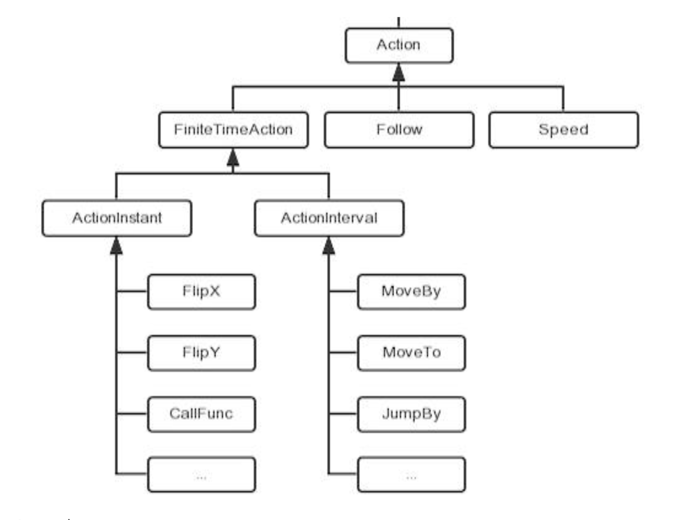

# 动作与动画

## 动作（Action）定义

- 动作类（cc.Action）是所有动作的基类，它实例化出来的对象代表一个动作（一般由子类来实例化具体动作）
- 动作作用于节点对象，每个动作都需要由节点对象来执行（如：精灵、按钮、层等）
- 在实际开发中，通常用到两类动作：`即时动作`和`间隔动作`，这两类动作都继承于有限时间动作类（FiniteTimeAction）

## 动作（Action）相关类图



## 控制动作

- 创建动作

  ```javascript
  var action = new cc.MoveBy(...);
  var action = cc.MoveBy.create(...);
  var action = cc.moveBy(...);
  ```

- 运行动作

  ```javascript
  node.runAction(action);
  ```

- 停止动作

  ```javascript
  node.stopAction(action);
  node.stopActionByTag(tag);
  node.stopAllAction();
  ```

- 暂停/恢复动作

  ```javascript
  node.pause();
  node.resume();
  ```

- 全局控制

  ```javascript
  cc.director.pause();
  cc.director.resume();
  ```

## 即时动作（ActionInstant）

- 位置调整

  ```javascript
  cc.place(position);
  ```

- 水平/垂直反转

  ```javascript
  cc.filpX(boolean);
  cc.filpY(boolean);
  ```

- 隐藏/显示

  ```javascript
  cc.hide();
  cc.show();
  ```

- 回调动作

  ```javascript
  cc.callFunc(select, target, data);
  ```

[demo](https://github.com/hewq/course-H5-Animation-and-Game-Development/tree/master/apps/ch10/LS10/Demo1)

## 间隔动作（ActionInterval）

- 移动

  ```javascript
  cc.moveBy(...);
  cc.moveTo(...);
  ```

- 跳跃

  ```javascript
  cc.jumpBy(...);
  cc.jumpTo(...);
  ```

- 旋转

  ```javascript
  cc.rotateBy(...);
  cc.rotateTo(...);
  ```

- 缩放

  ```javascript
  cc.scaleBy(...);
  cc.scaleTo(...);
  ```

- 淡入/淡出

  ```javascript
  cc.fadeIn();
  cc.fadeOut();
  cc.fadeTo();
  ```

[demo](https://github.com/hewq/course-H5-Animation-and-Game-Development/tree/master/apps/ch10/LS10/Demo2)

- 闪烁

  ```javascript
  cc.blink(...);
  ```

- 颜色

  ```javascript
  cc.tintBy(...);
  cc.tintTo(...);
  ```

- 进度条

  ```javascript
  var timer = new cc.ProgressTimer(aSprite);
  // 设置样式
  time.runAction(cc.progressTo(...));
  ```

[demo]()