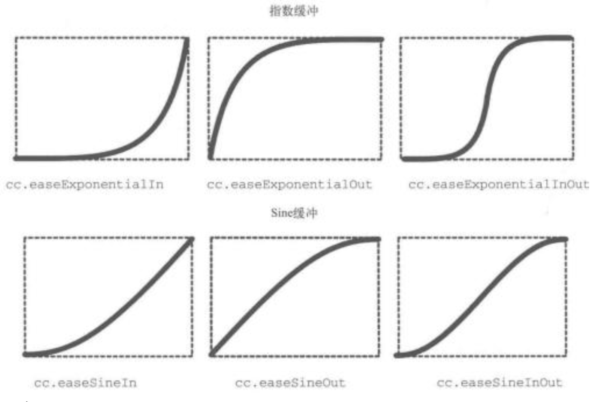
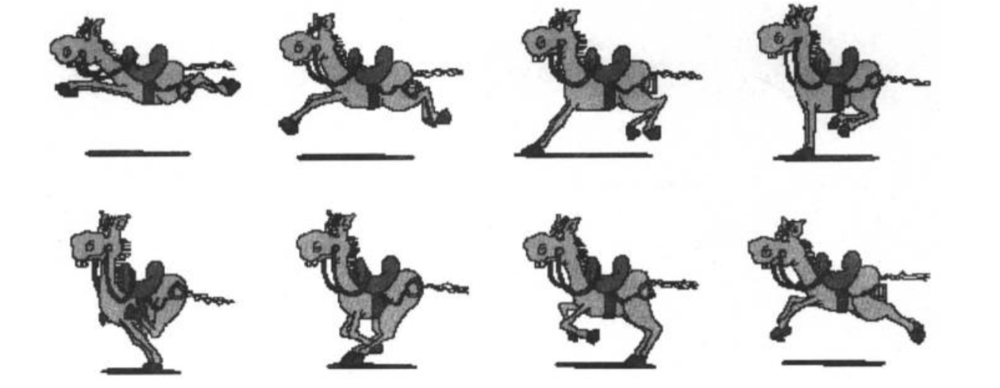
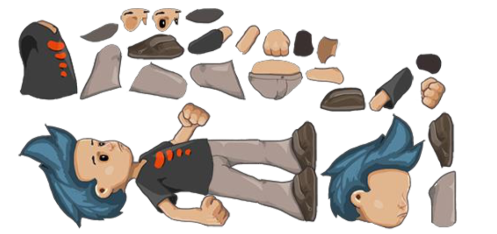
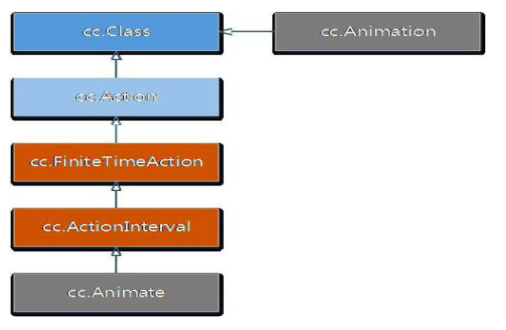

# 动作与动画

## 动作（Action）定义

- 动作类（cc.Action）是所有动作的基类，它实例化出来的对象代表一个动作（一般由子类来实例化具体动作）
- 动作作用于节点对象，每个动作都需要由节点对象来执行（如：精灵、按钮、层等）
- 在实际开发中，通常用到两类动作：`即时动作`和`间隔动作`，这两类动作都继承于有限时间动作类（FiniteTimeAction）

## 动作（Action）相关类图


## 控制动作

- 创建动作

  ```javascript
  var action = new cc.MoveBy(...);
  var action = cc.MoveBy.create(...);
  var action = cc.moveBy(...);
  ```

- 运行动作

  ```javascript
  node.runAction(action);
  ```

- 停止动作

  ```javascript
  node.stopAction(action);
  node.stopActionByTag(tag);
  node.stopAllAction();
  ```

- 暂停/恢复动作

  ```javascript
  node.pause();
  node.resume();
  ```

- 全局控制

  ```javascript
  cc.director.pause();
  cc.director.resume();
  ```

## 即时动作（ActionInstant）

- 位置调整

  ```javascript
  cc.place(position);
  ```

- 水平/垂直反转

  ```javascript
  cc.filpX(boolean);
  cc.filpY(boolean);
  ```

- 隐藏/显示

  ```javascript
  cc.hide();
  cc.show();
  ```

- 回调动作

  ```javascript
  cc.callFunc(select, target, data);
  ```

[demo](https://github.com/hewq/course-H5-Animation-and-Game-Development/tree/master/apps/ch10/LS10/Demo1)

## 间隔动作（ActionInterval）

- 移动

  ```javascript
  cc.moveBy(...);
  cc.moveTo(...);
  ```

- 跳跃

  ```javascript
  cc.jumpBy(...);
  cc.jumpTo(...);
  ```

- 旋转

  ```javascript
  cc.rotateBy(...);
  cc.rotateTo(...);
  ```

- 缩放

  ```javascript
  cc.scaleBy(...);
  cc.scaleTo(...);
  ```

- 淡入/淡出

  ```javascript
  cc.fadeIn();
  cc.fadeOut();
  cc.fadeTo();
  ```

[demo](https://github.com/hewq/course-H5-Animation-and-Game-Development/tree/master/apps/ch10/LS10/Demo2)

- 闪烁

  ```javascript
  cc.blink(...);
  ```

- 颜色

  ```javascript
  cc.tintBy(...);
  cc.tintTo(...);
  ```

- 进度条

  ```javascript
  var timer = new cc.ProgressTimer(aSprite);
  // 设置样式
  time.runAction(cc.progressTo(...));
  ```

[demo](https://github.com/hewq/course-H5-Animation-and-Game-Development/tree/master/apps/ch10/LS10/Demo3)

## 变速动画（cc.Speed、cc.ActionEase）

- 变速动作可以让指定的间隔动作发生速度上的变化

  - 线性动作变化（cc.Speed）、非线性动作变化（cc.ActionEase）

    

## 组合动作（实现复杂的动画功能）

- 顺序执行
  - cc.sequence(action1, action2, ...);
- 同步执行
  - cc.spawn(action1, action2, ...);
- 重复执行
  - cc.repeat(...);
  - cc.repeatFovever(...);
  - action.repeat(...);
  - action.repeateForever(...);
- 延迟执行
  - cc.delayTime(dt);
- 反向执行
  - cc.reverse(...);

[demo](https://github.com/hewq/course-H5-Animation-and-Game-Development/tree/master/apps/ch10/LS10/Demo4)

## 动画简介

- 帧动画

  

- 骨骼动画

  

## 帧动画

- 帧是动画或影像的基本单位。每一帧代表一画面，连续多帧画面组合在一起播放就形成了动画影像，就像电影胶卷连续播放。而帧频就是一秒内帧的数量，通用用 FPS（Frames Per Second）表示，帧频越高，画面就越流畅
- 一般电影为每秒 24 帧，而游戏一般以 60 fps 作为最高帧频，符合人眼识别的最高频率
- `project.json` 可以设置，默认 60

## 动画（Animation）

- 涉及两个类： cc.Animate / cc.Animation

  

## 动画（Animation）

- 帧动画是按一定时间间隔、一定顺序、逐帧地显示图片，与动作密不可分
- cc.Animate 类是动作类，属于间隔动作类，它的作用是将 cc.Animation 定义的动画转换成动作来执行
- cc.Animation 类， 负责装载帧动画里所有的帧
- 区分 Animate 于 Animation 不同的指责

**使用方法一**

```javascript
var animation = new cc.Animation();
for (var i = 1; i <= 6; i++) {
    var frameName = res['Pao_' + i + '_png'];
    animation.addSpriteFrameWithFile(frameName);
}
animation.setDelayPerUnit(1.0/35);
animation.setRestoreOriginalFrame(true);
var action = cc.animate(animation);
this._player.runAction(action.repeatForever());
```

**使用方法二**

```javascript
cc.spriteFrameCache.addSpriteFrames(res.Grossini_plist);
var spriteFrames = [];
for (var i = 1; i <= 14; i++) {
    var frame = cc.spriteFrameCache.getSpriteFrame('grossini_dance_generic_' + i + '.png');
    spriteFrames.push(frame);
}
var animation2 = new cc.Animation(spriteFrames, 0.2, 2);
var animate = cc.animate(animation2);
animation2.setRestoreOriginalFrame(true);
this._grossini.runAction(animate.repeateForever());
```

[demo](https://github.com/hewq/course-H5-Animation-and-Game-Development/tree/master/apps/ch10/LS10/Demo5)