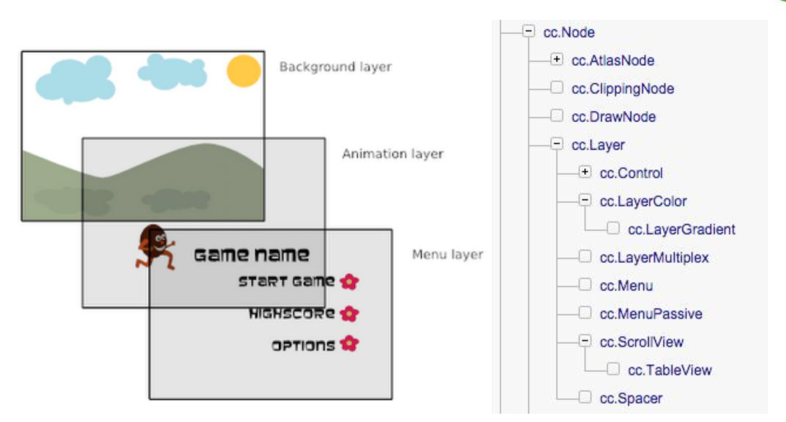
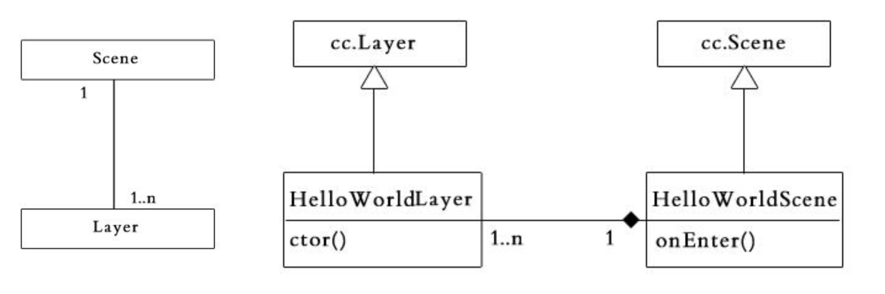
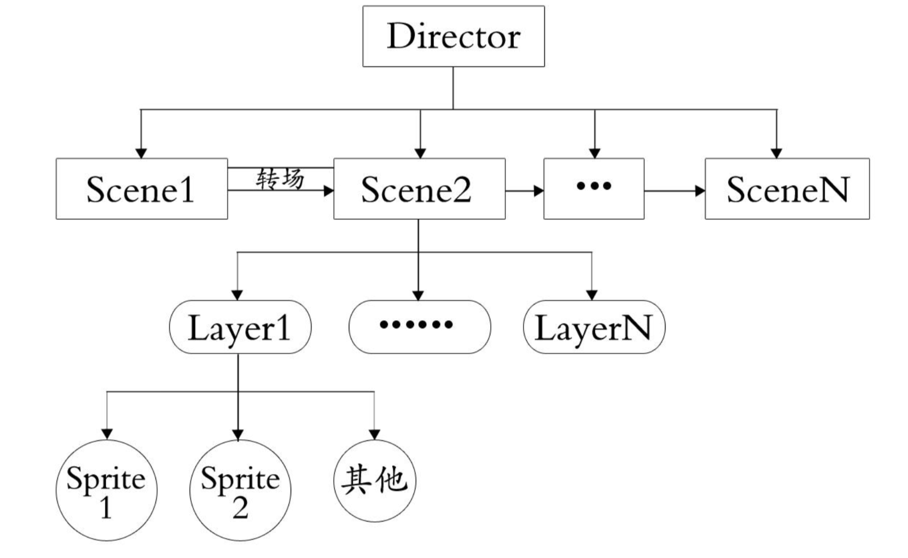

# 层、场景、导演

## 场景（Scene）

- 游戏中的场景就像是电影中变换舞台和场地，我们可以通过导演（cc.Director）的一系列方法控制游戏中不同的场景的自由切换
- 游戏实际中开发过程中，通常需要构建不同的场景（如：开始场景、主场景、结束场景）
- 游戏里关卡、版块的切换也就是一个一个场景的切换，如同电影中变换舞台和场地一样
- 场景通常是层的容器，包含了所有不同功能的游戏层
- 通常，当我们需要完成一个场景时，会创建一个 Scene 的子类，并在子类中实现我们需要的功能（初始化中载入游戏资源，为场景添加层，启动音乐播放等）
- 过度场景（cc.TransitionScene）是场景（cc.Scene）的子类，可以提升场景切换的效果

## 场景（cc.Scene）类图

[demo](https://github.com/hewq/course-H5-Animation-and-Game-Development/tree/master/apps/ch08/LS08/Demo1)

## 场景生命周期

- ctor() 构造函数
- onEnter() 进入场景时
- onEnterTransitionDidFinish() 进入且过渡结束
- onExit() 退出场景时
- onExitTransitionDidFinsish() 退出且过渡效果

[demo](https://github.com/hewq/course-H5-Animation-and-Game-Development/tree/master/apps/ch08/LS08/Demo2)

## 层（Layer）

- 层是处理玩家事件响应的 Node 子类
- 层通常包含的是直接在屏幕上呈现的内容（精灵，文本标签或者其他游戏元素），并且可以接受用户的输入事件，包括触摸，加速度和键盘输入等
- 游戏内容相关的逻辑代码也编写在层中
- 对于场景而言，通常我们添加的节点就是层，可以通过zOrder来调整顺序

## 层（cc.Layer）的组合模式及类图

[demo](https://github.com/hewq/course-H5-Animation-and-Game-Development/tree/master/apps/ch08/LS08/Demo3)

## 层及其子类的常用方式

- 自定义层（var MyLayer = cc.Layer.extend({});）
- 颜色层（cc.LayerColor）
- 层渐进层（cc.LayerGradient）
- 滑动视图（cc.ScrollView）
- 表视图（cc.TableView）
- 菜单（cc.Menu）

## 场景及层的关系

[demo](https://github.com/hewq/course-H5-Animation-and-Game-Development/tree/master/apps/ch08/LS08/Demo4)

## 导演、场景、层

## 核心概念（导演-单例模式）

- 环境设定
  - 设置显示游戏的视图，包含视图的投射，像素格式，等等
  - 设置游戏运行帧率及一些全局状态
- 执行主循环
  - 暂停主循环：`cc.director.pause();`
  - 恢复主循环：`cc.director.resume();`
- 场景管理
  - `cc.director.runScene(scene);`
  - `cc.director.popScene();`

## 导演（实验）

- 单例模式
  - cc.director、cc.Director._getInstance();
- 导演控制场景切换
  - `cc.director.runScene()`
  - `cc.director.pushScene()`
  - `cc.director.popScene()`
  - `cc.director.popToRootScene()`
- 导演控制暂停、继续
  - `cc.director.pause()`
  - `cc.director.resume()`