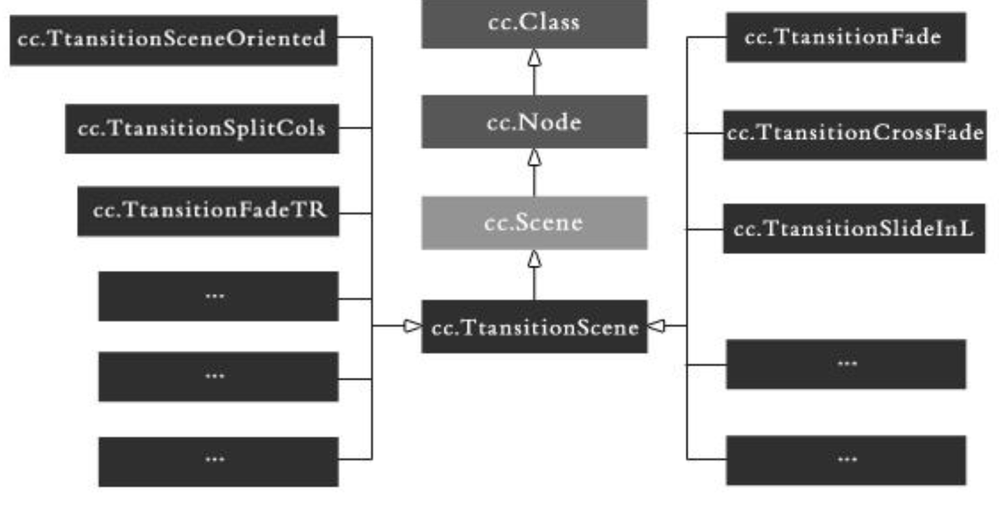

# 层、场景、导演

## 场景（Scene）

- 游戏中的场景就像是电影中变换舞台和场地，我们可以通过导演（cc.Director）的一系列方法控制游戏中不同的场景的自由切换
- 游戏实际中开发过程中，通常需要构建不同的场景（如：开始场景、主场景、结束场景）
- 游戏里关卡、版块的切换也就是一个一个场景的切换，如同电影中变换舞台和场地一样
- 场景通常是层的容器，包含了所有不同功能的游戏层
- 通常，当我们需要完成一个场景时，会创建一个 Scene 的子类，并在子类中实现我们需要的功能（初始化中载入游戏资源，为场景添加层，启动音乐播放等）
- 过度场景（cc.TransitionScene）是场景（cc.Scene）的子类，可以提升场景切换的效果

## 场景（cc.Scene）类图

## 场景生命周期

- ctor() 构造函数
- onEnter() 进入场景时
- onEnterTransitionDidFinish() 进入且过渡结束
- onExit() 退出场景时
- onExitTransitionDidFinsish() 退出且过渡效果