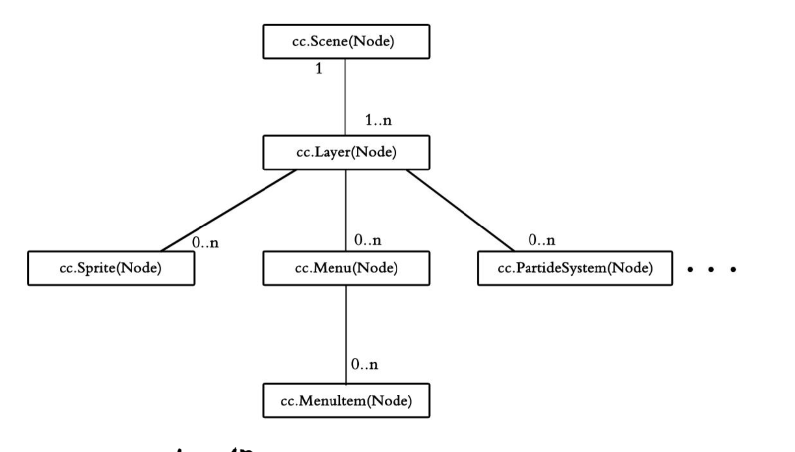

# 工程结构及核心概念

## 工程结构概述

-  Frameworks （引擎框架）

  - cocos2d-html5、cocos2d-x、runtime-src

- res（资源目录）

- src（源代码）

- index.html、main.js （程序入口）

- project.json （配置文件）

  - debugMode、showFPS、frameRate、renderMode、engineDir、modules、jsList

- Cocos 工程结构（ frameworks、res、src 等）

  

## Cocos2d-JS 游戏启动流程

- 工程启动及加载流程图

  

## 工程文件综述

- index.html（调取 CCBoot.js 获取 project.json 配置信息）

  

- project.json 工程配置文件

  - 调试模式、是否显示帧率、默认帧率设置、渲染模式
  - 引擎模块、脚本索引列表


- resource.js 资源索引

  

- 程序入口文件 main.js

  

- 起始场景案例 app.js

  

## Cocos2d-JS 中的面向对象机制

- 在开源社区中 John Resiq 在他的博客中提供了一种简单 JavaScript 继承方法。Cocos2d-JS 使用的就是这种方法
- John Resiq 的简单 JavaScript 继承方法灵感来源于原型继承机制，它具有于 Java 等面向对象一样的类概念，并且他设计类所有类的根类  Class

## 核心概念

- 坐标系、节点（Node)
- 定时器（schedule）
- 标签及菜单（Label、Menu、MenuItem)
- 场景与层（Scene、Layer）
- 导演（Director)
- 精灵（Sprite）
- 动作与动画（Action、Animation)

## 坐标系

- 笛卡尔（右手）坐标系，原点为左下角

  

## Cocos2d-JS坐标系

- Cocos2d 采用的是笛卡尔坐标系

  

- UI 坐标系与 Cocos2d(OpenGL) 坐标系

## 节点（Node）

- cc.Node 类是所有可视化组件类的根类

  

- **注：一般常用 Node 子类来实例化对应的可视化组件**

## 节点（树形结构管理）

- Cocos2d-JS 采用层级（树形）结构来管理场景、层、精灵、菜单等节点（Node)

  

## 节点（属性、方法）

- 常用方法：addChild、getChildByTag、removeChild、setZOrder、setScale、setPosition、setVisiable、pause、onEnter、onExit、schedule、update...
- 常用属性：_visible、tag、_parent、_scheduler、_running、_localZOrder...

## 锚点

- 锚点就是给节点定位和仿射变换的基准点

  取值范围[0, 1]，层的默认锚点为(0, 0)，其他节点为(0.5, 0.5)，可设置锚点忽略

  

## 本地坐标系 VS 世界坐标系、z 轴

- 本地坐标系（100， 50），世界坐标系（200， 100）


- node1 的位置(20, 40)，锚点(0, 0)，node2 位置(-5, -20)，锚点是(1, 1)

  ```javascript
  var point = node1.convertToNodeSpace(node2.getPosition());
  var point = node1.convertToNodeSpaceAR(node2.gtPosition());
  ```

  

  node2 世界坐标转换为 node1 本地坐标系中的坐标，point 等于 (-25, -60)

  **应用场景：塔防游戏等**

- Node1 为根节点位置(20, 40)，锚点(0, 0)，node2_ 子节点位置(-5, -20)，锚点是(1, 1)

  ```javascript
  var point = node1.convertToWorldSpace(node2_.getPosition());
  var point = node1.convertToWorldSpaceAR(node2_.getPosition());
  ```

  

  node2_ 在 node1 本地坐标系中的坐标转换为世界坐标，其结果是 point 等于 (15, 20)

  **应用场景：飞机游戏等**

## z 轴

- localZOrder

- addChild 方法中第二个参数

  

## Node 节点定时器

```javascript
/*开启定时器*/
scheduleUpdate(); // update 方法循环调用
schedule(callback, interval, repeat, delay);
scheduleOnce();

/*停止定时器*/
unscheduleUpdate();
unschedule(callback);
unscheduleAllCallback();
```

[demo1](https://github.com/hewq/course-H5-Animation-and-Game-Development/tree/master/ch06/LS06/Demo1)

[demo2](https://github.com/hewq/course-H5-Animation-and-Game-Development/tree/master/ch06/LS06/Demo2)

[demo3](https://github.com/hewq/course-H5-Animation-and-Game-Development/tree/master/ch06/LS06/Demo3)

