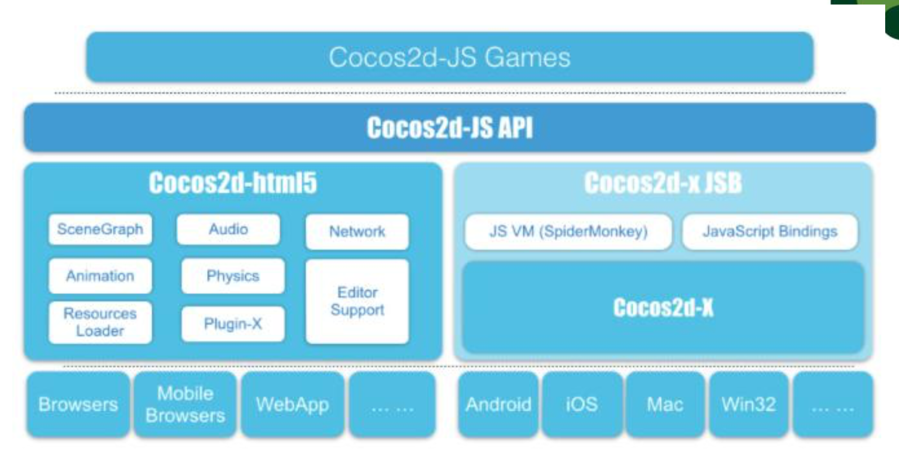
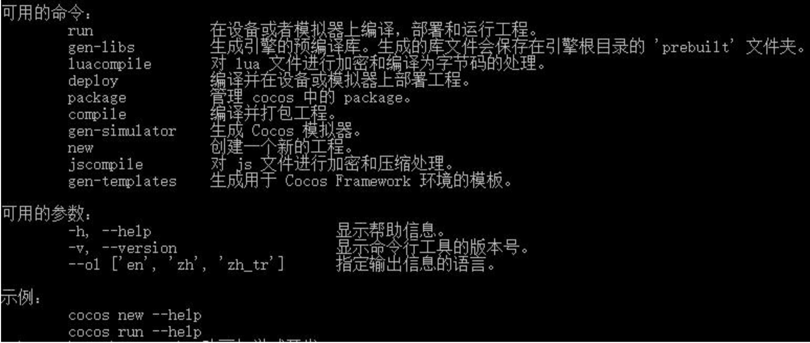

# 引擎简介及环境搭建

## 游戏引擎

- 游戏引擎是指一些已编写好的编辑电脑游戏系统或者一些交互式实时图像应用程序的`核心组件系统`。这些系统为游戏设计者提供编写游戏所需的`各种工具`，其目的在于让游戏设计者能容易和快速地做出游戏程序而不用由零开始。
- 常用引擎
  - Cocos2d 系列（2d 为主）
  - Unity 3D 引擎（3d 为主）
  - 其他引擎（虚幻、白鹭）

## 现阶段 Cocos 主要分支

- Cocos2d-iPhone (Object-C)
- Cocos2d-x (C++)
- Quick-Cocos2d-x (Lua)
- Cocos2d-Html5 (JavaScript)
- 从 3.7 之后统一为 Cocos

## Cocos2d-JS 引擎特点

- Cocos2d-JS 是开源跨平台的游戏引擎
- 采用原生 JavaScript 语言
- 可发布到包括 Web 平台，iOS, Android 等多平台
- 融合了 Cocos2d-HTML5 和 Cocos2d-x JavaScript Bindings (JSB)

## Cocos2d-JS 引擎整体架构

## 开发环境（ Web 非原生开发）

- Python

- Cocos2d-JS 引擎 [http://www.cocos.com/download](http://www.cocos.com/download)

-  WebStorm 或 Cocos IDE

- Chrome 浏览器

- **注：使用终端进入 Cocos2d 根目录，运行 python setup.py 进行引擎安装，纯 Web 开发可点击回车跳过 Android SKD、NDK、Ant 等路径设置**

- Cocos 常用命令

  

## 实验1 （ Web 非原生开发）

- 下载并安装 Python （运行 python -V 查看 Python 版本）
- 进入引擎根目录，运行 python setup.py
- 新建文件夹 CocosJS 作为工程目录
- 使用终端进入工程文件夹，运行命令 cocos new -l js L01
- 使用 WebStorm 打开以及建好的项目并调试

[demo](https://github.com/hewq/course-H5-Animation-and-Game-Development/tree/master/apps/ch05/LS05/Demo)