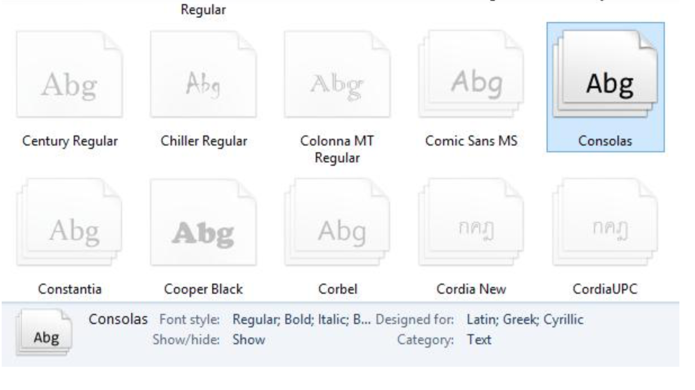
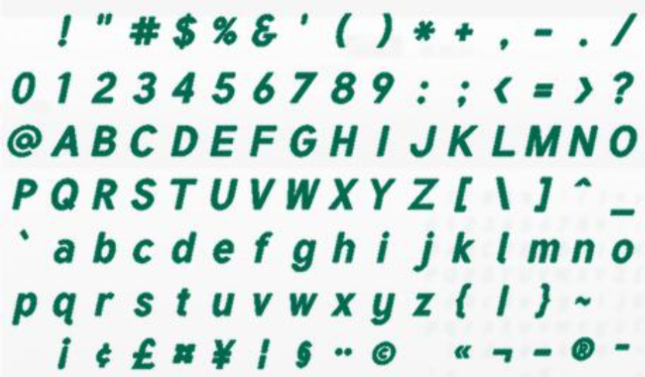
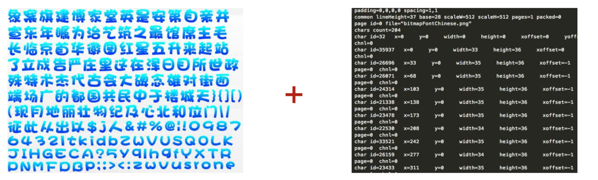
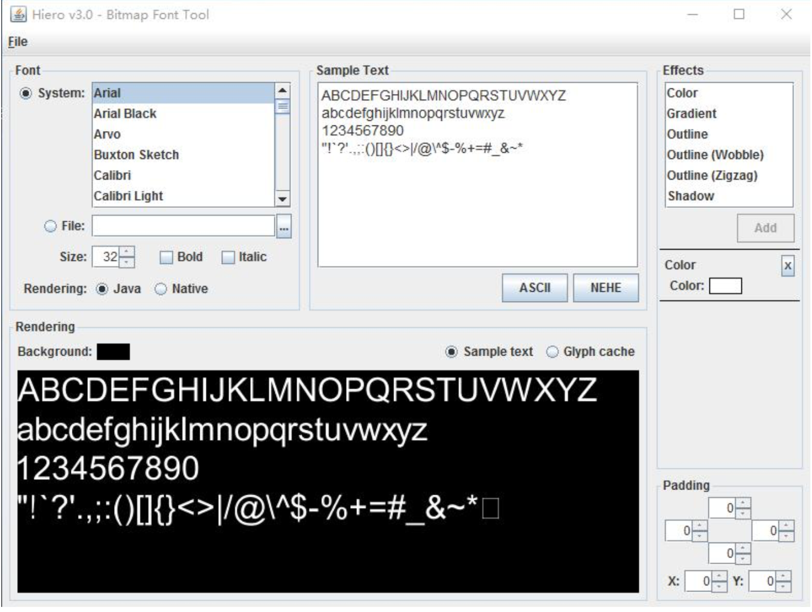
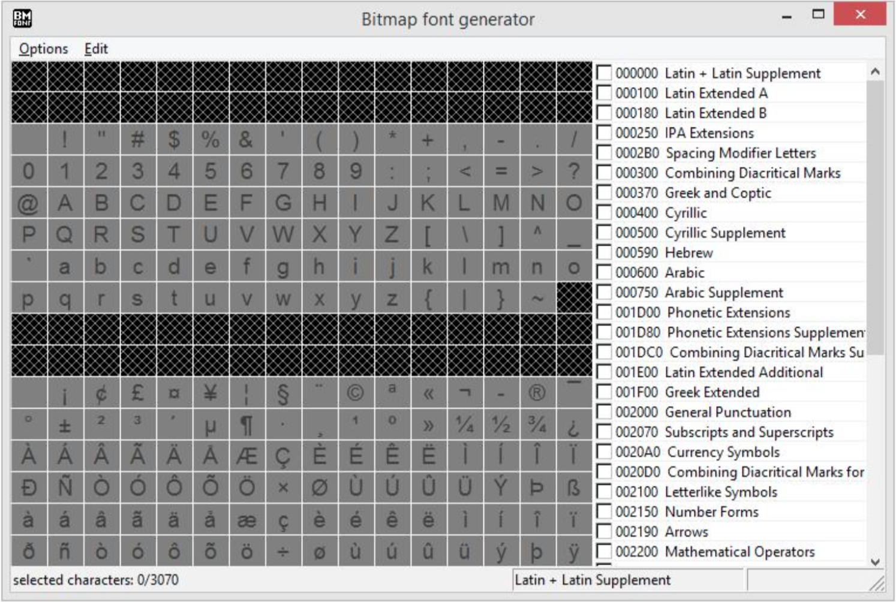
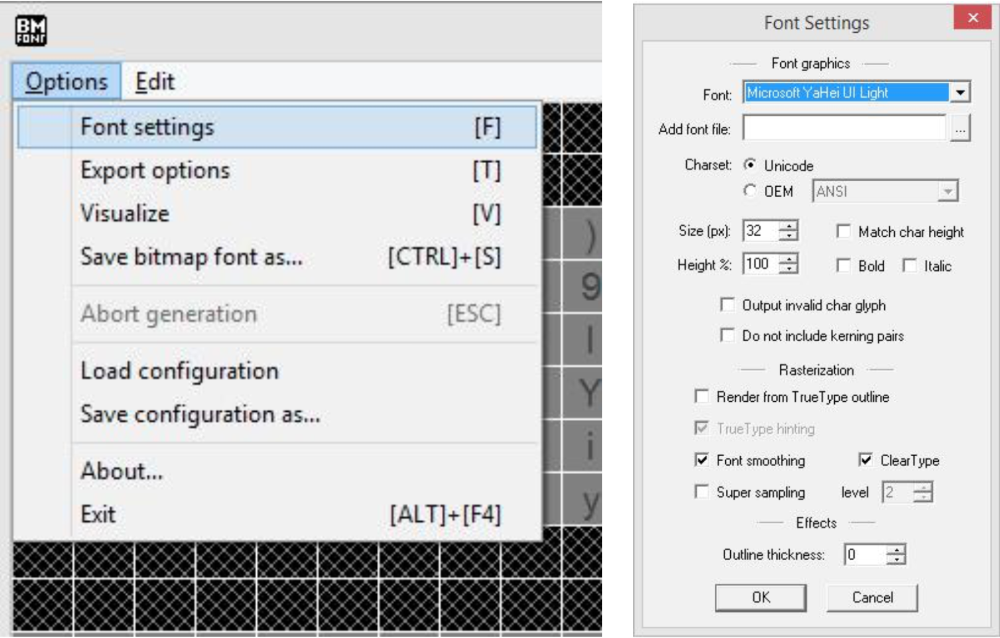
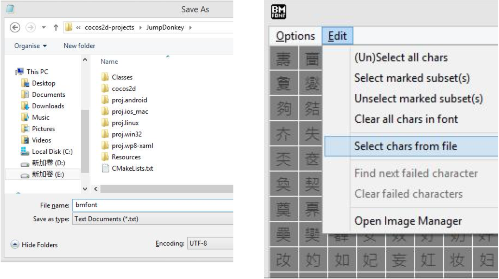
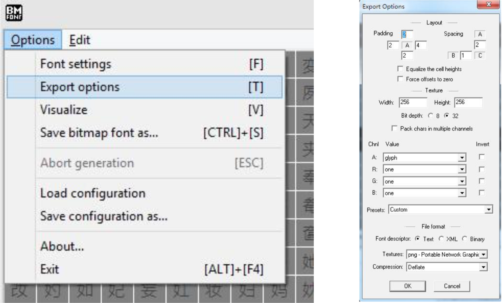
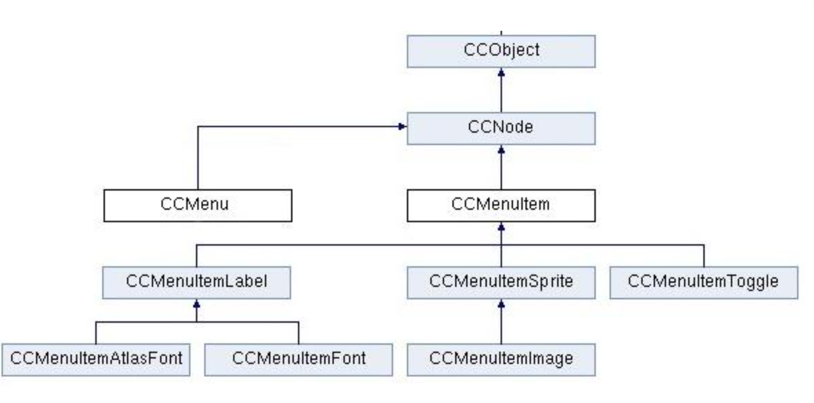

# 标签与菜单

## 标签种类

- TTF 标签
- Atlas 标签
- BMFont 标签

## cc.LabelTTF（字体标签）

- TTF（TrueType Font）是一种字库规范，字体文件格式

  

```javascript
var label = new cc.LabelTTF(text, fontName, fontSize, dimensions, hAlignment, vAlignment);
```

- 设置字体效果（颜色、描边、投影等）
- 可使用 TTF 字体文件，生成相应字体的标签
- 自定义字体在 JSB 中不能正常显示
- 简单、效率比较低、字体资源太大

## cc.LabelAtlas（图片集标签）

- 从图片中找出对应字的位置和尺寸，裁切取得字符
- 以连续的 scall 码识别，常用于显示数字或英文字符



```javascript
var label = new cc.LabelAtlas('23', res.LabelAtlas_png, 96, 128, ''); // 字符、atlas图集、字宽、长、开始字符（效率比 TTF 标签高）
```

- 字符位图（.png）、配置文件（.fnt）



- 生成位图文件工具

  - Hiero.jar （字体工具）、Bitmap Font Generator（windows）

- 生成 BNFont 标签节点

  ```javascript
  new cc.LabelBMFont(str, fntFile, width, alignment, imageOffset);
  ```

## Hero.jar 字体工具

- 设置字体样式，设置文本内容，导出字体图片及配置信息

  

## Bitmap Font Generator

[http://www.angelcode.com/products/bmfont/](http://www.angelcode.com/products/bmfont/)



- 设置字体

  

- 创建并选择文本（选择 UTF8 格式）

  

- 导出设置

  

[demo](https://github.com/hewq/course-H5-Animation-and-Game-Development/tree/master/ch07/LS07/Demo1)

## 菜单

- 标签菜单
- 精灵和图片菜单
- 开关菜单

## 菜单项与菜单（MenuItem、Menu）



## 字体标签菜单

- 设置全局字体类型（cc.MenuItemFont.setFontName）

- 设置全局字体尺寸（cc.MenuItemFont.setFontSize）

  ```javascript
  var startMenuItem = new cc.MenuItemFont('开始', function () {
      cc.log('开始按钮点击啦！');
  }, this);
  this.addChild(menu);
  // 设置菜单对齐方式
  menu.alignItemsHorizontally();
  menu.alignItemsHorizontallyWithPadding(size.width * 0.2);
  ```

[demo](https://github.com/hewq/course-H5-Animation-and-Game-Development/tree/master/ch07/LS07/Demo2)

## 精灵和图片菜单

```javascript
var startMenuItem = new cc.MenuItemImage(res.PlayBtnNormal_png, res.PlayBtnSelected_ong, function () {
    cc.log('开始按钮点击啦！');
}, this);
```

[demo](https://github.com/hewq/course-H5-Animation-and-Game-Development/tree/master/ch07/LS07/Demo3)

## 开关菜单

- 首先创建两个菜单项 musicOnItem、musicOffItem

- 创建开关菜单项，参数为已创建的两个菜单项

  ```javascript
  var toggleMenuItem = new cc.MenuItemToggle(musicOnItem, musicOffItem, function () {
      cc.log(toggleMenuItem.getSelectedIndex());
  }, this);
  var menu = new cc.Menu(toggleMenuItem);
  this.addChild(menu);
  // cc.sys.localStorage 简单数据存储 (key, value)
  // setItem(key, value);getItme(key);
  ```

[demo](https://github.com/hewq/course-H5-Animation-and-Game-Development/tree/master/ch07/LS07/Demo4)