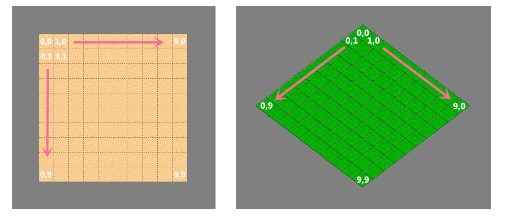
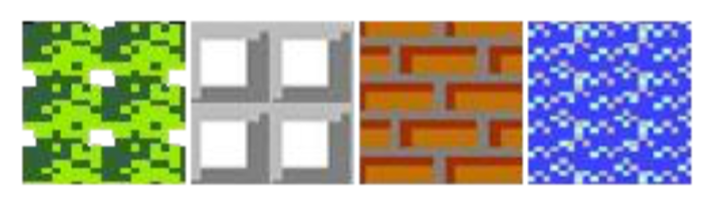
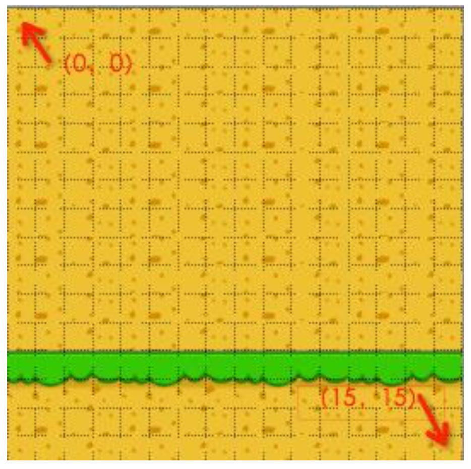
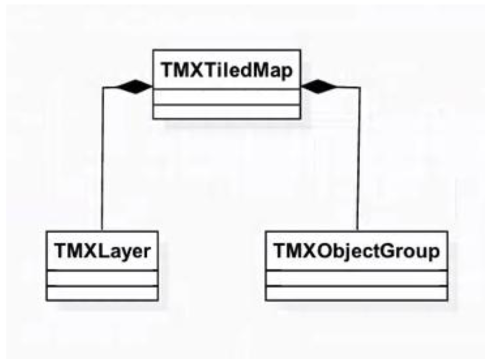
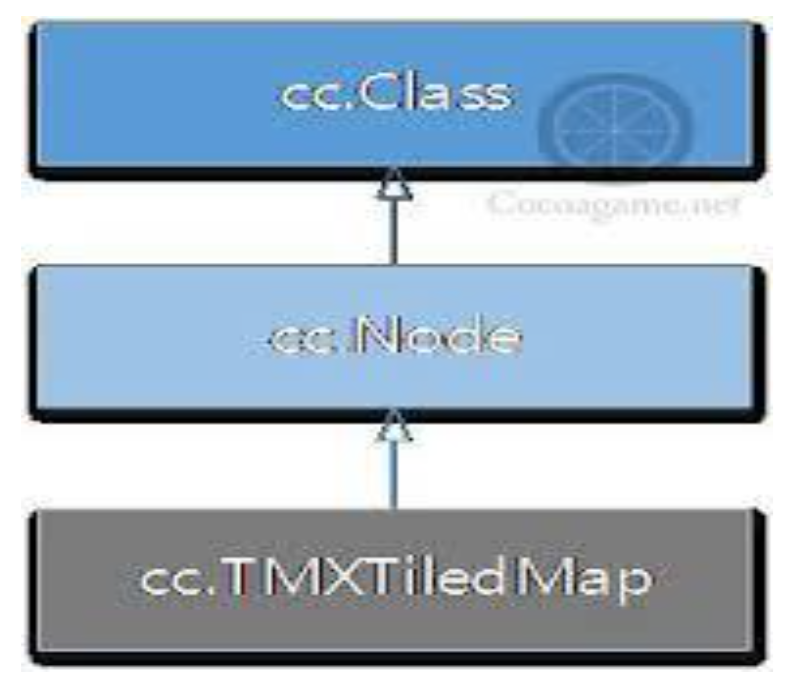
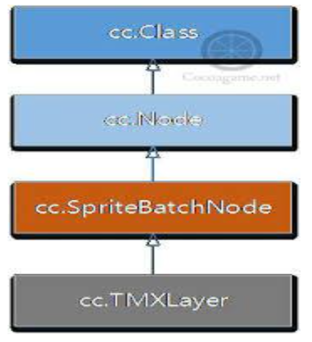
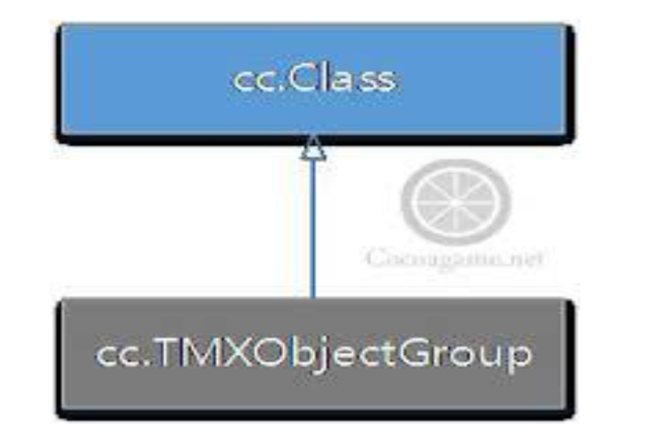

# 瓦片地图（TiledMap）

## 概念

- 在游戏开发过程中，我们会遇到超过屏幕大小的地图，这类游戏通常会有丰富的背景元素，如果直接使用背景图切换的方式，需要为每个不同的场景准备一张背景图，这样会造成资源浪费（美术工作、内存分配、生成的包的体积）
- 瓦片地图就是为了解决这问题而产生的。一张大的世界地图或者背景图可以由几种地形来表示，每种地形对应一张小的图片，我们称这些小的地形图片为瓦片。把这些瓦片拼接在一起，一个完整的地图就组合出来了，这就是瓦片地图的原理

## TiledMap 方案

- 在 Cocos2d-x 中，瓦片地图实现的是 TiledMap 方案，TiledMap 要求每个瓦片占据地图上一个四边形或六边形的区域。把不同的瓦片拼接在一起，就可以组成完整的地图了。我们需要很多较小的纹理来创建瓦片。通常我们会将这些较小的纹理放在一张图片中，这样做会提高绘图性能。
- 瓦片地图由编辑器 Tiled Map Editor 制作，并保存为 TMX 格式的地图（[http://www.mapeditor.org](http://www.mapeditor.org/)）

## 瓦片地图

- 地图方向

  - 直角鸟瞰地图（90度地图）

  - 等距斜视地图（斜45度地图）

    

- 地图资源

  - 建议瓦片地图素材大小为 32 * 32 的倍数

  - 瓦片素材组与其他图片不能混合使用

  - 只有瓦片素材图能被导入 TMX 文件

  - 每个 Layer 最多支持 1 套瓦片素材组

    

- 瓦片地图坐标系

  - 瓦片地图坐标系如下图，以瓦片为单位（不是以像素为单位）

  - （0， 0）： 左上角

  - （15，15）：右下角

    

- 全局标识（GIDS）
  - 瓦片的 GID 是一个全局标识量，它的范围从正整数 1 开始，到瓦片地图中到 tile 的总量。
  - 如果你的地图中有 5 个不同的瓦片，那么：
    - 瓦片 0 的 GID 为 1
    - 瓦片 1 的 GID 为 2
    - 瓦片 2 的 GID 为 3
    - 以此类推
    - 瓦片的 GID 为 0 被用来表示此瓦片为空

## 瓦片地图（TMXTiledMap）

- Cocos2d-JS 中访问瓦片地图 API，主要的类有：TMXTiledMap、TMXLayer 和 TMXObjectGroup 等

  

- TMXTiledMap 是瓦片地图类，它的类图如下图所示，TMXTiledMap 派生自 Node 类，具有 Node 特点

  

- TMXTiledMap 常用的函数如下：

  ```javascript
  new cc.TMXTiledMap(tmxFile) // 创建瓦片地图对象
  getLayer(layerName) // 通过层名获得层对象
  getObjectGroup(groupName) // 通过对象层名获得层中对象组集合
  getObjectGroups() // 获得对象层中所有对象组集合
  getProperties() // 获得地图属性
  getPropertiesForGID(GID) // 通过 GID 获得属性
  ```

- 获得瓦片地图尺寸及瓦片尺寸

  getMapSize() // 获得地图的尺寸， 它的单位是瓦片

  getTileSize() // 获得瓦片尺寸， 它的单位是像素

- 获得瓦片层和对象组示例代码如下：

  ```javascript
  var group = _tileMap.getObjectGroup('Objects');
  var background = _tileMap.getLayer('Background');
  // 其中 _tileMap 是瓦片地图对象
  ```

## 瓦片地图（TMXLayer）

- TMXLayer 是地图层类，它的类图如下图所示，TMXLayer 父类派生自 Node 类，也具有 Node 特点。同时 TMXLayer  派生自 SpriteBatchNode 类，所有 TMXLayer 对象具有批量渲染的能力，瓦片地图层就是由大量重复的图片构成，它们需要渲染提高性能

  

- TMXLayer 常用的函数如下：

  ```javascript
  getLayer(layerName) // 获得层
  getLayerSize(); // 获得瓦片尺寸，它的单位是瓦片
  getMapTileSize(); // 获得瓦片尺寸，它的单位是像素
  getPositionAt(pos); // 通过瓦片坐标获得像素坐标，瓦片坐标 y 轴方向与像素坐标 y 轴方向相反
  getTileGIDAt(pos); // 通过瓦片坐标获得 GID 值
  ```

## 瓦片地图（TMXObjectGroup）

-  TMXObjectGroup 是对象层中的对象组集合，它的类图如下图所示，注意 TMXObjectGroup 与 TMXLayer 不同，TMXObjectGroup 不是派生自 Node，不具有 Node 特性。

  

- TMXObjectGroup 常用函数如下：

  ```javascript
  propertyNamed(propertyName); // 通过属性名获取属性值
  getProperties(); // 获得对象组的属性
  getObject(objectName); // 通过对象名获得对象
  getObjects(); // 获得所有对象（数组）
  ```

[demo](https://github.com/hewq/course-H5-Animation-and-Game-Development/tree/master/apps/ch14/LS14/Demo1)

[demo](https://github.com/hewq/course-H5-Animation-and-Game-Development/tree/master/apps/ch14/LS14/Demo2)