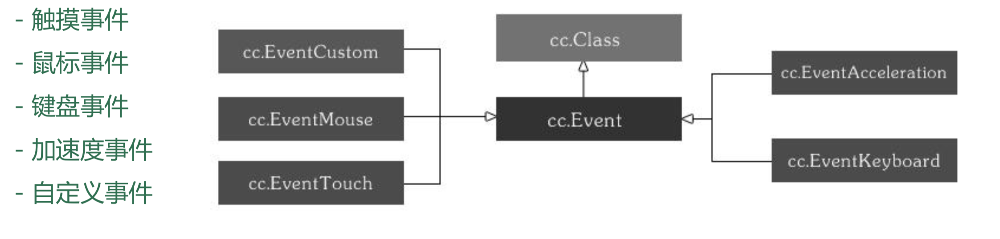

# 用户事件

## Cocos2d-JS 事件及事件源

- 事件（cc.Event）

  

- 事件对象是包含事件相关信息的对象，如点击的坐标，滑动的距离等

## Cocos2d-JS 事件监听器及管理器

- 事件监听器（cc.EventListener）

  ```javascript
  cc.EventListener.TOUCH_ONE_BY_ONE // 单点
  cc.EventListener.TOUCH_ALL_AT_ONCE // 多点
  cc.EventListener.MOUSE
  cc.EventListener.KEYBOARD
  cc.EventListener.ACCELERATION
  cc.EventListener.CUSTOM
  ```

- 事件管理器（cc.eventManager）

  ```javascript
  cc.EventManager // 负责添加、删除事件监听器
  cc.eventManager.addListener(listener, nodeOrPriority);
  cc.eventManager.removeListener(listener);
  cc.eventManager.removeListeners(listenerType, recursive); // 类型、递归
  ```

## Cocos2d-JS 事件处理流程

- 首先需要创建一个事件监听器
- 在监听器中实现各种事件处理逻辑
- 将监听器加入到事件管理器中
- 当事件触发时，事件管理器会根据事件类型分发给相应的事件监听器

下面以一个简单的示例来演示使用的方法

```javascript
// 单点触摸（完整写法）
var listener = cc.EventListener.create({
    event: cc.EventListener.TOUCH_ONE_BY_ONE,
    swallowTouches: true,
    onTouchBegan: function (touch, event) {
        return true; // 返回布尔类型，若返回为 false 则，后边回调都不再执行
    },
    onTouchMoved: function (touch, event) {},
    onTouchEnded: function (touch, event) {},
    onTouchCancelled: function (touch, event) {}
});
cc.eventManager.addListener(listen, this);

// 单点触摸（简化写法）
cc.eventManager.addListener({
    event: cc.EventListener.TOUCH_ONE_BY_ONE,
    swallowTouches: true,
    onTouchBegan: function (touch, event) {
        return true;
    },
    onTouchMoved: function (touch, event) {},
    onTouchEnded: function (touch, event) {},
    onTouchCancelled: function (touch, event) {}
}, this);
```

 [demo](https://github.com/hewq/course-H5-Animation-and-Game-Development/tree/master/apps/ch11/LS11/Demo1)

## 自定义精灵的单点触摸

- 自定义精灵，添加事件监听器，两种方式
  - cc.Touch
    - touch.getLocation(); // 点击坐标
    - touch.getDelta(); // 移动偏移量
  - cc.Event
    - event.getCurrentTarget(); // 事件源
  - 使用 getBoundngBox 或坐标系转换判断点位置（后者更为准确，参见实例）

## 多点触摸

```javascript
cc.eventManager.addListener({
    event: cc.EventListener.TOUCH_ALL_AT_ONCE,
    onTouchesBegan: function (touches, event) {},
    onTouchesMoved: function (touches, event) {},
    onTouchesEnded: function (touches, event) {},
    onTouchesCancelled: function (touches, event) {}
}, this);
```

## 键盘事件

```javascript
if ('keyboard' in cc.sys.capabilities) {
    cc.eventManager.addListener({
        event: cc.EventListener.KEYBOARD,
        onKeyPressed: function (key, event) {
            var strTemp = 'Key down:' + key;
        },
        onKeyReleased: function (key, event) {
            var strTemp = 'Key up:' + key;
        }
    }, this);
}
```

[demo](https://github.com/hewq/course-H5-Animation-and-Game-Development/tree/master/apps/ch11/LS11/Demo2)

## 鼠标事件

```javascript
if ('mouse' in cc.sys.capabilities) {
    cc.eventManager.addListener({
        event: cc.EventListener.MOUSE,
        onMouseDown: function (event) {},
        onMouseMove: function (event) {},
        onMouseUp: function (event) {}
    }, this);
}
```

## 加速计事件

```javascript
if ('accelerometer' in cc.sys.capabilities) {
    cc.eventManager.addListener({
        event: cc.EventListener.ACCELERATION,
        callback: function (accelEvent, event) {
            // accelEvent.x
            // accelEvent.timestamp
        }
    }, this);
}
```

## 自定义事件

- 事件创建与分发

  ```javascript
  var event = new cc.EventCustom('event_name');
  event.setUserData('Data');
  cc.eventManager.dispatchEvent(event);
  ```

- 事件响应

  ```javascript
  var listener = cc.EventListener.create({
      event: cc.EventListener.CUSTOM,
      eventName: 'event_name',
      callback: function (event) {
          cc.log('Custom event received,' + event.getUserData());
      }
  });
  cc.eventManager.addListener(listener, 1);
  ```

  [demo](https://github.com/hewq/course-H5-Animation-and-Game-Development/tree/master/apps/ch11/LS11/Demo3)

  [demo](https://github.com/hewq/course-H5-Animation-and-Game-Development/tree/master/apps/ch11/LS11/Demo4)