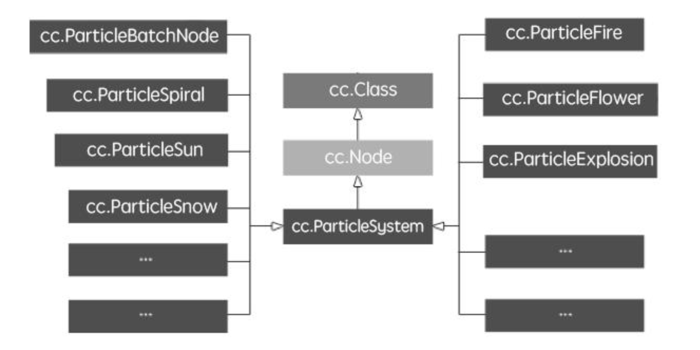
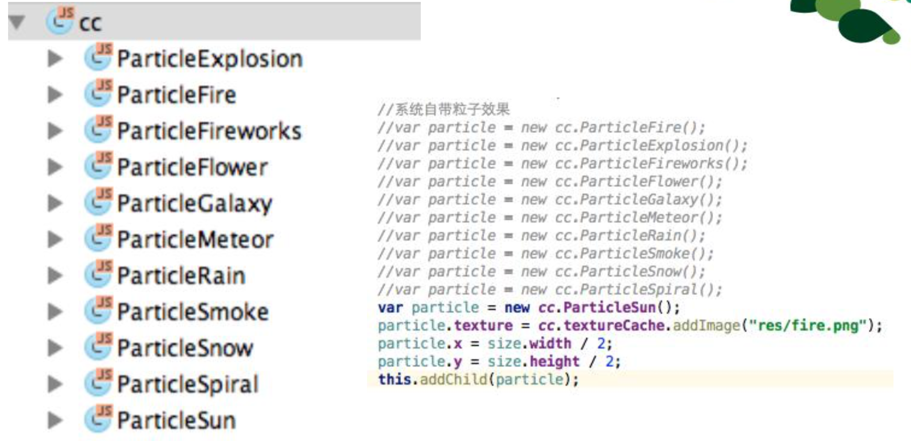
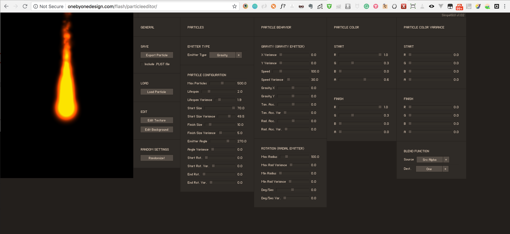
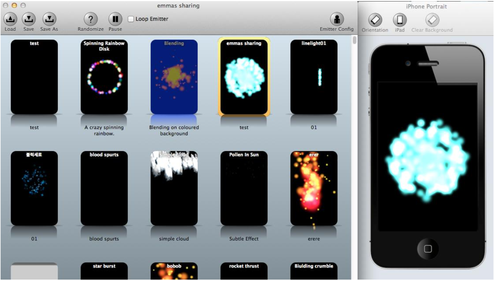
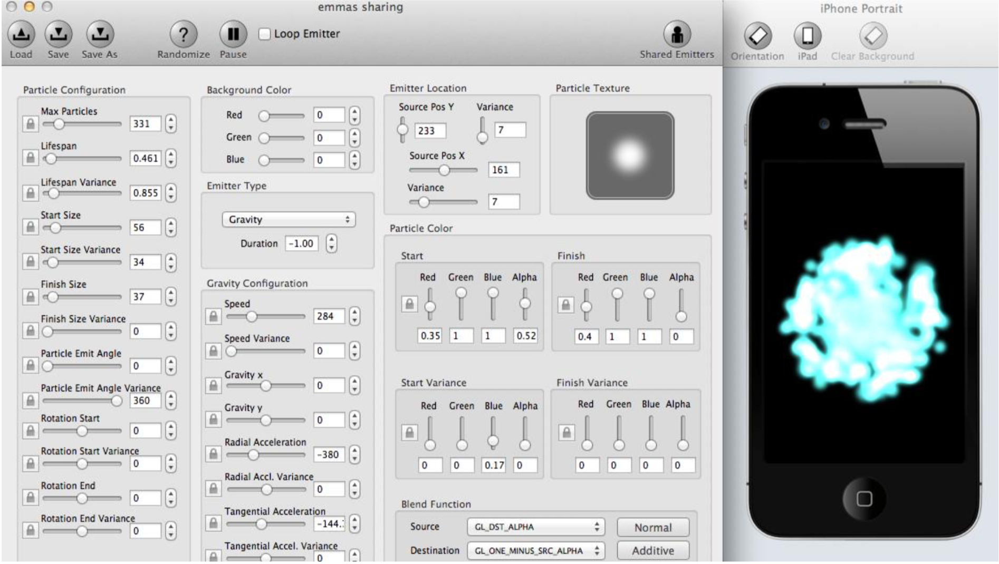
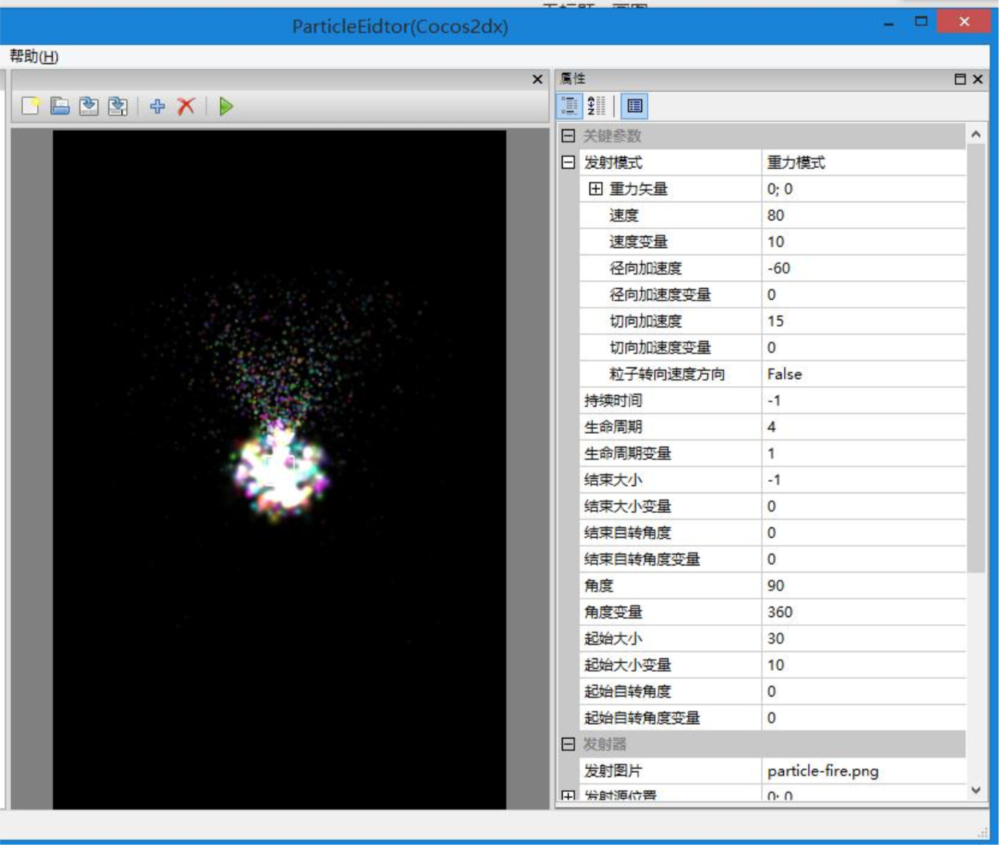

# 粒子系统

## 粒子系统

- 模拟自然界的粒子物理运动规律
  - 下雪、下雨
  - 火、烟雾
  - 爆炸等效果
- 与帧动画做对比（开发成本、安装包体积、随机性等）
- 粒子生命周期（产生、消失）
- 粒子系统特点：微观上随机、宏观上有规律
- 重力模式和半径模式

## 粒子系统类图



## 引擎自带粒子效果



## 自定义粒子效果

```javascript
var customParticle = new cc.ParticleSystem(res.Untitled_plist);
customParticle.x = size.width / 2;
customParticle.y = size.height / 2;
this.addChild(customeParticle);
// 下边为设置具体粒子系统属性
customParticle.setTotalParticles(500);
customeParticle.setStartSize(20);
customeParticle.setEndSize(20);
```

## 自定义粒子效果的设置

- 粒子配置（Particle Configuration）
- 发射器类型 （Emitter Type）
- 重力配置（Gravity Configuration）
- 径向配置（Radial Configuration）
- 发射器位置（Emitter Location）
- 粒子纹理（Particle Texture）
- 粒子颜色（Particle Color）
- 混合模式（Blend Function）

## 粒子编辑器（在线）



[http://onebyonedesign.com/flash/particleeditor/](http://onebyonedesign.com/flash/particleeditor/)

## 粒子编辑器（Mac）





## 粒子编辑器（Window）

