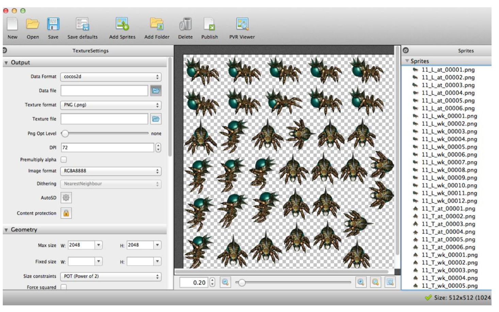
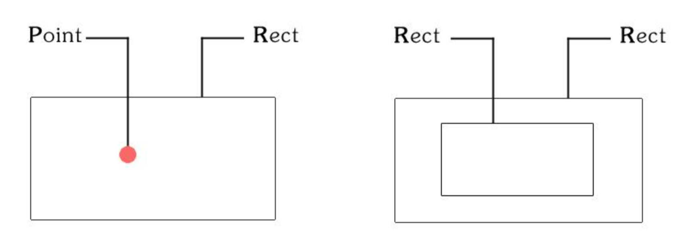

# 精灵

## 精灵概念

- 游戏中的主角、飞机、子弹等等都是精灵。它可以移动，旋转，缩放，执行动画，播放帧动画，并接受其他转换
-  Cocos2dx 的 Sprite 由 Texture, frame 和 animation 组成，由 OpenGL ES 负责渲染
- 精灵一般要结合事件处理、碰撞检查等操作完成游戏逻辑

## 纹理及纹理图集

- 使用图片生成精灵（png、jpg）

- 纹理图集生成精灵（TexturePacker 生成图片及配置文件）

  

## 创建精灵对象（常用方式）

- 根据图片路径创建

  ```javascript
  var sp1 = new cc.Sprite(res.bg_png);
  var sp2 = new cc.Sprite(res.bg_png, cc.rect(0, 0, 20, 20), null);
  ```

- 根据精灵表（纹理图集）中精灵帧名创建

  ```javascript
  cc.spriteFrameCache.addSpriteFrames(plist 路径，图片路径)
  var sp2 = new cc.Sprite(#bg.png);
  ```

- 根据精灵帧

  ```javascript
  cc.spriteFrameCache.addSpriteFrames(plist 路径，图片路径)
  var spriteFrame = cc.spriteFrameCache.getSpriteFrame(str);
  var sp3 = new cc.Sprite(spriteFrame);
  ```

  [demo](https://github.com/hewq/course-H5-Animation-and-Game-Development/tree/master/apps/ch09/LS09/Demo1)

##  精灵帧缓存及性能优化

- 减少文件读取次数
- 减少渲染引擎的绘制调用并加速渲染
- Zwoptex 和 TexturePacker

## 碰撞检测

- 通过 getBoundingBox() 方法获得精灵矩形区域（cc.Rect 类型）

- cc.rectContainsPoint(矩形, 点); // 点在矩形内

- cc.rectContainsRect(矩形, 矩形); // 矩形在矩形内

  

[demo](https://github.com/hewq/course-H5-Animation-and-Game-Development/tree/master/apps/ch09/LS09/Demo1)

## 屏幕适配方案

```javascript
cc.ResolutionPolicy.EXACT_FIT（可能有拉伸）
cc.ResolutionPolicy.NO_BORDER (没有拉伸，但可能有裁切)
cc.ResolutionPolicy.SHOW_ALL (没有拉伸，但可能有黑边)
cc.ResolutionPolicy.FIXED_HEIGHT (用于横屏游戏)
cc.ResolutionPolicy.FIXED_WIDTH (用于竖屏游戏)
```

[demo](https://github.com/hewq/course-H5-Animation-and-Game-Development/tree/master/apps/ch09/LS09/Demo2)

## 简易飞机游戏

- 设置屏幕适配方案（竖屏游戏）
- 创建3个场景（StartScene、MainScene、OverScene）
- 实现开始开始场景（标题、菜单、场景跳转）
- 实现主游戏场景（游戏逻辑、距离累加及记录、场景跳转）
- 实现结束场景（当前分数和最高分数的读取及设置、展示）
- 优化（场景过度效果、场景及飞机随机更换）
- 发布（publish，注意非中文目录）