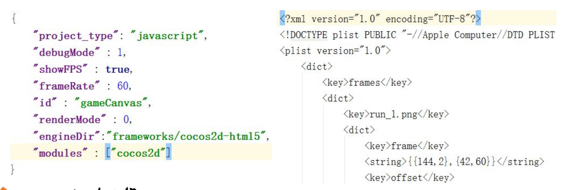

# 音乐音效与数据存储

## 音乐音效

### 音乐与音效、音频格式

- 音乐（游戏背景音乐，用来渲染场景的听觉气氛）
  - 相对较长，一般只播放一首
- 音效（游戏的增强表现）
  - 通常是一些较短的声音，如子弹发射声音、按钮音效等
  - 音效支持一次同时播放多个
- 音频的格式
  - WAV（无损压缩）、MP3（高压缩比）、WMA(微软格式)
  - CAFF（苹果）、AIFF（苹果）、OGG（类似MP3）
  - MID

### cc.audioEngine 播放声音 API

```javascript
- cc.audioEngine.playMusic(url, loop)
- cc.audioEngine.stopMusic()
- cc.audioEngine.pauseMusic()
- cc.audioEngine.resumeMusic()
- cc.audioEngine.isMusicPlaying()
- cc.audioEngine.getMusicVolume()
```

### cc.AudioEngine 播放音效 API

```javasctipt
- cc.audioEngine.playEffect(url, loop) // 返回对应的 audioID
- cc.audioEngine.pauseEffect(audioID)
- cc.audioEngine.pauseAllEffect()
- cc.audioEngine.resumeEffect(audioID)
- cc.audioEngine.resumeAllEffects()
- cc.audioEngine.stopEffect(audioID)
- cc.audioEngine.stopAllEffects()

```

[demo](https://github.com/hewq/course-H5-Animation-and-Game-Development/tree/master/apps/ch12/LS12/Demo1)

## 数据存储

### 数据存储

- Coccos2d-JS 中数据存储的方式

  - cc.sys.localStorage (观察 Application 窗口中的 Local Storage)

  - JSON 文件、plist 文件（XML 格式）

  - SQLite 实现数据存储（通过脚本绑定）

    

### 数据存储案例

- cc.localStorage 的存取方法

  ```javascript
  cc.sys.localStorage.setItem(key, value);
  cc.sys.localStorage.getItem(key);
  cc.sys.localStorage.removeItem();
  cc.sys.localStorage.clear();
  ```

- JSON 与 Plist 的存取方法

  ```javascript
  cc.loader.load(res.Test_plist, function (err, results) {
      if (err) {
          return;
      } else {
          cc.log(results);
      }
  });
  ```

[demo](https://github.com/hewq/course-H5-Animation-and-Game-Development/tree/master/apps/ch12/LS12/Demo2)