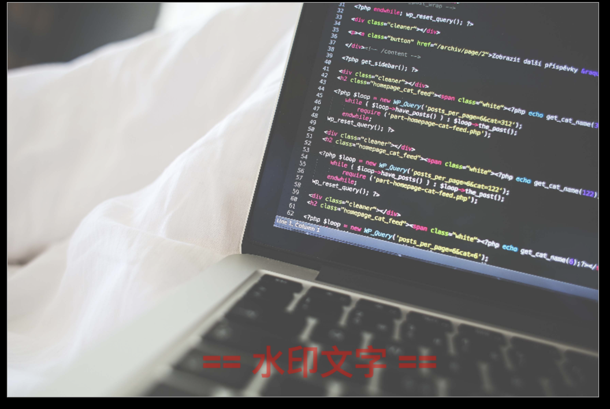

# H5 Canvas 图像操作

## Canvas 图像基础

- context 绘制图像的方法

  ```javascript
  drawImage(image, dx, dy)
  drawImage(image, dx, dy, dw, dh)
  drawImage(image, sx, sy, sw, sh, dx, dy, dw, dh)
  ```

- image 参数的种类

  - HTMLImageElement（图片）
  - HTMLCanvasElement（Canvas 元素）
  - HTMLVideoElement（视频）

  [demo](https://github.com/hewq/course-H5-Animation-and-Game-Development/blob/master/apps/ch03/LS03/LS03_01.html)

- [context 绘制图像案例（缩放）](https://github.com/hewq/course-H5-Animation-and-Game-Development/blob/master/apps/ch03/LS03/LS03_02.html)

- [离屏 Canvas 案例（实现离屏水印效果）](https://github.com/hewq/course-H5-Animation-and-Game-Development/blob/master/apps/ch03/LS03/LS03_03.html)

  

- [交互 Canvas 案例（实现放大镜效果）](https://github.com/hewq/course-H5-Animation-and-Game-Development/blob/master/apps/ch03/LS03/LS03_04.html)

  

## Canvas 图像像素级操作

- ImageData

  - ImageData 描述 `<canvas>`元素的一个隐含像素数据的区域。使用 ImageData() 构造函数创建或者使用和 canvas 在一起的 CanvasRenderingContext2D 对象的创建方法 createImageData() 和 getImageData() 。也可以使用 putImageData() 设置 canvas 的一部分

- ImageData 对象属性

  - data （Uint8ClampedArray 描述一个`一维数组`，包含以`RGBA 顺序`的数据`0~255`）
  - width（无符号长整型（unsigned long），使用像素描述 ImageData 的实际宽度）
  - height（无符号长整型（unsigned long），使用像素描述 ImageData 的实际高度）

- context 像素级操作相关的方法

  ```javascript
  context.getImageData(sx, sy, sw, sh); // 返回 ImageData 对象
  context.putImageData(imagedata, dx, dy);
  context.putImageData(imagedata, dx, dy, dirtyX, dirtyY, dirtyWidth, dirtyHeight);
  context.createImageData(sw, sh);
  context.createImageData(imageData);
  ```

[demo1](https://github.com/hewq/course-H5-Animation-and-Game-Development/blob/master/apps/ch03/LS03/LS03_05.html)

[demo2](https://github.com/hewq/course-H5-Animation-and-Game-Development/blob/master/apps/ch03/LS03/LS03_06.html)