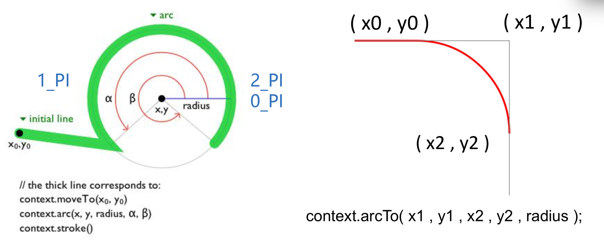
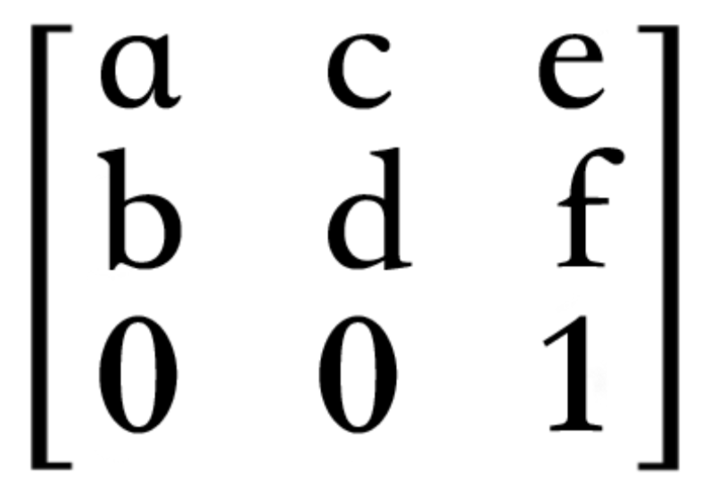

# H5 Canvas 基础

##  Canvas 简单案例

- 获得 Canvas 元素节点

  ```JavaScript
  var theCanvas = document.getElementById('canvas');
  theCanvas.width = 300;
  theCanvas.height = 150
  ```

- 获得和设置 Canvas 的图形上下文

  ```javascript
  var context = theCanvas.getContext('2d'); // 返回 CanvasRenderingContext2D 对象
  context.fillStyle = "#ff0000";
  ```

- 通过 Canvas API 绘制图形图像

  ```javascript
  context.fillRect(0, 0, 100, 100); // context.strokeRect(0, 0, 100, 100); 注意顺序的影响
  context.clearRect(25, 25, 50, 50);
  ```

## Canvas 的尺寸大小（元素大小、绘画表面大小）

- Canvas `元素样式`的大小（若不设置，则大小同绘图表面大小）

  ```html
  <style>
      #CanvasOne {	/*通过 css 样式设置 Canvas 元素大小*/
  		width: 200px;
          height: 200px;
      }
  </style>
  <canvas id="CanvasOne"></canvas>
  ```

- Canvas 绘图表面的大小（默认宽度为300，高为150）

  ```html
  <canvas id="CanvasOne"></canvas>
  <canvas id="CanvasTwo" width="200" height="100"></canvas>
  ```

- Canvas 元素大小和绘制表面大小不一致时，会产生`拉伸现象`。

[demo](https://github.com/hewq/course-H5-Animation-and-Game-Development/blob/master/ch02/LS02/LS02_01.html)

## Canvas 图形上下文（context）

- Canvas 区别与 Flash、SVG，Canvas 不是对绘制对象进行操作，而是`基于状态`的绘制。
- Canvas 状态存储在图形上下文 context 中
  - 上下文属性（描边样式、填充样式、全局透明度、线宽、线连接方式等）
  - 变换矩阵信息（平移、旋转、缩放）
  - 剪贴区域：通过clip()方法创建的
- context 原型链及继承关系
  - context 的构造器（constructor）为 CanvasRenderingContext2D
  - context 对象的原型为 CanvasRenderingContext2D.prototype

[demo](https://github.com/hewq/course-H5-Animation-and-Game-Development/blob/master/ch02/LS02/LS02_02.html)

## Canvas 图形上下文的状态存储

- context 保存与恢复绘图上下文状态（Save、Restore）

  - 保存上下文状态到栈中，save 之后，可调用平移、缩放、旋转、裁剪等操作
  - 恢复上下文之前保存的状态，防止 save 后对 Canvas 执行的操作对后续的绘制有影响

- context 状态保存及恢复案例，理解状态堆栈

  ```javascript
  context.fillStyle = 'red';
  context.save();
  context.fillStyle = 'blue';
  context.fillRect(0, 0, 200, 200);
  context.restore();
  context.fillRect(100, 100, 100, 100);
  ```

[demo](https://github.com/hewq/course-H5-Animation-and-Game-Development/blob/master/ch02/LS02/LS02_03.html)

## Canvas 图形及路径

- Canvas 直线相关绘制

  > 状态设置
  >
  > > ```javascript
  > > context.moveTo(100, 100);
  > > context.lineTo(200, 200);
  > > context.lineWidth = 10;
  > > context.strokeStyle = '#058';
  > > ```
  >
  > 绘制
  >
  > >context.stroke()

- 也可以通过 Path2D 构造函数创建路径对象

-  理解 beginPath 的作用（绘制多条直线时可能遇到的问题）

  - canvas 中的绘制方法（如 stroke， fill），都会以“上次 beginPath“之后的所有路径为基础进行绘制，不管你用 moveTo 把画笔移动到哪里，只要不 beginPath，都是在画一条路径，fillRect 与 strokeRect 这种直接画出独立区域的函数，也不会打断当前的 path

- 理解 closePath 的作用

  - closePath 的意思不是结束路径，而是关闭路径，它会试图从（moveTo点之后）当前路径的终点连一条路径到起点，让整个路径闭合起来。但是，这并不意味着它之后的路径就是新路径了

- beginPath 和 closePath 的作用不同，并不是必须成对出现

[demo](https://github.com/hewq/course-H5-Animation-and-Game-Development/blob/master/ch02/LS02/LS02_04.html)

- 线宽及颜色样式
  - lineWidth、strokeStyle、fillStyle
  - stroke()、fill()
- 线端点样式（lineCap)
  - butt(default)、round、square
- 连接点样式（lineJoin)
  - miter(default)、 bevel、round
- 样式与上下文状态（context status）

[demo](https://github.com/hewq/course-H5-Animation-and-Game-Development/blob/master/ch02/LS02/LS02_05.html)

- Canvas 曲线相关绘制（绘制弧）

  - context.arc(centerx, centery, radius, startingAngle, endingAngle, anticlockwise = false)

    

[demo](https://github.com/hewq/course-H5-Animation-and-Game-Development/blob/master/ch02/LS02/LS02_06.html)

- Canvas 曲线相关绘制（绘制二次曲线）

  context.moveTo(x0, y0);

  context.quadraticCurveTo(x1, y1, x2, y2);  // x1, y1: 控制点；x2, y2: 结束点

- Canvas 曲线相关绘制（绘制贝塞尔曲线）

  context.moveTo(x0, y0);

  context.bezierCurveTo(x1, y1, x2, y2, x3, y3);  // x1, y1: 控制点；x2, y2: 控制点； x3, y3: 结束点

[demo](https://github.com/hewq/course-H5-Animation-and-Game-Development/blob/master/ch02/LS02/LS02_07.html)

## Canvas 绘制基本形状

- Canvas 绘制矩形相关

  > > ctx.moveTo(x, y);
  > > ctx.lineTo(x + width, y);
  > > ctx.lineTo(x +width, y + height);
  > > ctx.lienTo(x, y + height);
  >
  > ctx.rect(x, y, width, height);

- 手动绘制的区别在于能够控制绘图方向（对填充的影响）

- 其他相关方法（fillRect()、 strokeRect()、 clearRect()）

- Canvas 绘制椭圆形相关

  ```javascript
  var canvas = document.getElementById('canvas');
  var ctx = canvas.getContext('2d');
  ctx.beginPath();
  // x, y, radiusX, radiusY, rotation, startAngle, endAngle, anticlockwise(默认为false)
  ctx.ellipse(100, 100, 50, 75, 45 * Math.PI / 180, 0, 2 * Math.PI); // 倾斜45度角
  ctx.stroke();
  ```

- 扩展 context

  ```javascript
  CanvasRenderingContext2D.prototype.triangle = function (x1, y1, x2, y2, x3, y3) {
      this.moveTo(x1, y1);
      this.lineTo(x2, y2);
      this.lineTo(x3, y3);
      this.closePath();
      this.stroke();
  }
  ```

[demo](https://github.com/hewq/course-H5-Animation-and-Game-Development/blob/master/ch02/LS02/LS02_08.html)

## Canvas 图案描边及填充

- 描边及填充的类型

  - 纯色（不同设置方式）
  - 渐变色（线性渐变、径向渐变）
  - 图案样式（图片、视频、 Canvas元素节点）

- 纯色描边及填充颜色设置（String 类型）

  - #ffffff、#642
  - rgb(255, 128, 0)、rgba(100, 100, 100, 0.8)
  - hsl(20, 62%, 28%)、H:Hue 色相 S: Saturation 饱和度 L Lightness 明度
  - red、yellow、blue

- 线性渐变色描边及填充案例

  ```javascript
  // 线性渐变
  var grd = context.createLinearGradient(xstart, ystart, xend, yend);
  grd.addColorStop(stop1, color1);
  grd.addColorStop(stop2, color2);
  context.fillStyle = grd;
  ```

  ```javascript
  // 径向渐变
  var grd = context.createRadialGraient(x0, y0, r0, x1, y, r1);
  grd.addColorStop(stop1, color1);
  grd.addColorStop(stop2, color2);
  context.fillStyle = grd;
  ```

[demo](https://github.com/hewq/course-H5-Animation-and-Game-Development/blob/master/ch02/LS02/LS02_09.html)

- 图案描边及填充

  ```javascript
  var pattern = context.createPattern(image | video, repeat-style)
  var pattern = context.createPattern(canvas, repeat-style)
  ```

- 图案描边及填充重复样式（repeat-style）

  - no-repeat（不重复） repeat（重复）
  - repeat-x（x轴重复） repeat-y（y轴重复）

- 设置填充样式（图案）

  - context.fillStyle = pattern;
  - Context.strokeStyle = pattern;

- 图案描边及填充（使用图片填充案例）

  ```javascript
  var canvas = document.getElementById('canvas');
  var context = canvas.getContext('2d');
  
  var img = new Image();
  img.src = './images/fill_20x20.gif';
  img.onload = function () {
      var pattern = context.createPattern(img, 'repeat');
      context.fillStyle = pattern;
      context.fillRect(0, 0, 400, 400);
  }
  ```

- 图案描边及填充（使用 Canvas 填充案例）

[demo](https://github.com/hewq/course-H5-Animation-and-Game-Development/blob/master/ch02/LS02/LS02_10.html)

## Canvas 阴影设置

- 阴影设置参数
  - context.shadowColor
  - Context.shadowOffSetX
  - context.shadowOffSetY
  - context.shadowBlur

[demo](https://github.com/hewq/course-H5-Animation-and-Game-Development/blob/master/ch02/LS02/LS02_11.html)

## Canvas 图像合成

- 全局透明度
  - context.globalAlpha = 1; // (default)
- 全局图像混合设置
  - context.globalCompositeOperation = 'source-over'; // (default)
- 图像混合类型
  - source-over、source-atop、source-in、source-out 
  - destination-over、destination-atop、destination-in、destination-out
  - lighter、copy、xor

[demo](https://github.com/hewq/course-H5-Animation-and-Game-Development/blob/master/ch02/LS02/LS02_12.html)

## Canvas 坐标系变换

- 平移（translate）

  - context.translate(x, y);

- 旋转（rotate）

  - context.rotate(deg);

- 缩放（scale）

  - context.scale(sx, sy);

- 矩阵变换（transform）

  - a 水平缩放（1）
  - b 水平倾斜（0）
  - c  垂直倾斜（0）
  - d 垂直缩放（1）
  - e 水平位移（0）
  - f 垂直位移（0）

  

- 矩阵变换方法

  - transform(a, b, c, d, e, f) 是对当前坐标系进行变换，
  - setTransform(a, b, c, d, e, f) 是对默认坐标系进行变换，忽略之前的级联变换

[demo](https://github.com/hewq/course-H5-Animation-and-Game-Development/blob/master/ch02/LS02/LS02_13.html)

## Canvas 文本

- 文字渲染基础
  - context.font = 'bold 40px Arial';
  - context.fillText(string, x, y, [maxlen]);
  - context.strokeText(string, x, y, [maxlen]);
- 字体（font）设置综述
  - font-style（normal 默认、italic 斜体、oblique 倾斜）
  - font-variant（normal、small-caps）
  - font-weight（lighter、normal 默认、bord、bolder）
  - font-size（20px、2em、150%）
  - font-family（多种字体备选以逗号分割、Web安全字体）

[demo](https://github.com/hewq/course-H5-Animation-and-Game-Development/blob/master/ch02/LS02/LS02_14.html)

- 文本水平对齐
  - context.textAlign = left | center | right
- 文本垂直对齐
  - context.textBaseline = top | middle | bottom
  - context.textBaseline = alphabetic（default） | ideographic（汉字等方块字体）
- 文本度量
  - context.measureText(string).width

[demo](https://github.com/hewq/course-H5-Animation-and-Game-Development/blob/master/ch02/LS02/LS02_15.html)

## Canvas 剪切

- Canvas 剪切方法与剪切路径
  - 绘制路径后使用 context.clip() 剪切
  - 剪切后，新绘制的图形将限定在此剪切区域
- 剪切与状态的关系
  - 有时可能需要取消或者新定义裁切区
  - 构建剪切区前可先保存状态（save）
  - 存储后，再绘制的图形将限定在裁剪区域内
  - 完成剪切区内的绘制后可进行状态恢复（restore）
- 非零环绕原则

[demo](https://github.com/hewq/course-H5-Animation-and-Game-Development/blob/master/ch02/LS02/LS02_16.html)

## Canvas 交互

- Canvas 交互检查方法

  ```javascript
   context.isPointInPath(x, y);
   context.isPointInPath(path, x, y);
   context.isPointInStroke(x, y);
   context.isPointInStroke(path, x, y);
  // 鼠标点击的位置，注意坐标补偿
   var x = e.clientX - theCanvas.getBoundingClientRect().left;
   var y = e.clientY - theCanvas.getBoundingClientRect().top;
  
  ```

[demo](https://github.com/hewq/course-H5-Animation-and-Game-Development/blob/master/ch02/LS02/LS02_17.html)

