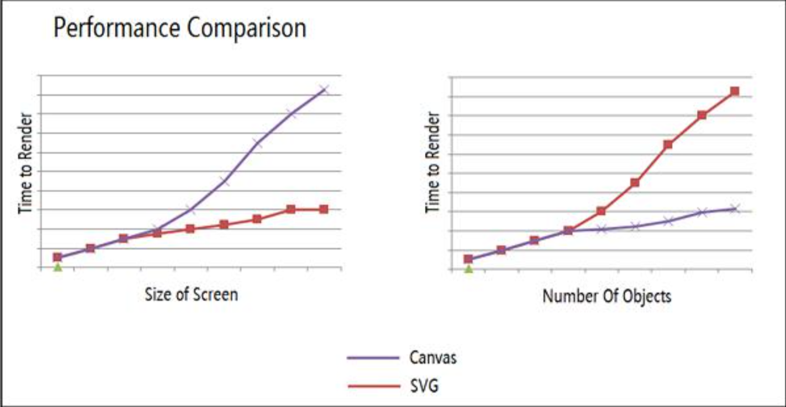
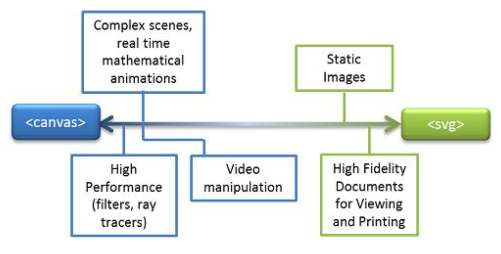

# 概述 -- Canvas、SVG、WebGL

## Canvas 简介

- Canvas 是 H5 出现的新标签，用于在 Web 端完成图形的绘制和动画的实现，它是 `图形动画的容器`，与其他 DOM 元素节点类似（拥有对应的`属性、方法和事件`）
- Canvas 提供了相应的 API，通过 js 脚本来完成相应的图形、图像及动画操作（用程序来`绘画、图像处理和生成动画`） 
- Canvas 是`基于状态`绘图，采用`即时模式（immediate mode）`进行`位图`的绘制和操作

[demo](https://github.com/hewq/course-H5-Animation-and-Game-Development/blob/master/ch01/LS01/LS01_01.html)

## SVG 概述

- SVG 是基于可扩展标记语言`XML`，用于描述二维`矢量图形`的一种图形格式（2003 年 1 月 14 日成为 W3C 推荐标准）
- SVG 基于 XML，这意味着 SVG DOM 中的每个元素都是可用的，可以为每个元素附加 JavaScript 事件处理器
- 在 SVG 中，每个被绘制的图形均被视为一个对象（SVG `保留模式`区别于 Canvas 的`即时模式`），如果 SVG 对象的属性发生变化，那么浏览器能够自动重现图形

## SVG 的优势

- SVG  图像可通过文本编辑器来创建和修改
- SVG   图像可被搜索、索引、脚本化或压缩
- SVG 是可伸缩的矢量图
- SVG 图像可在任何分辨率下被高质量打印
- SVG 图像文件尺寸更小（节省空间），可压缩性更强
- SVG 是开放的标准

[demo](https://github.com/hewq/course-H5-Animation-and-Game-Development/blob/master/ch01/LS01/LS01_02.html)

## Canvas 与 SVG 对比

- Canvas

  - 依赖分辨率（基于像素的位图）、事件模型/用户交互是粒度（x, y）
  - 单个 HTML 元素，仅通过脚本进行修改，`即时模式（immediate mode）`
  - 最适合图像密集型的游戏，其中的许多对象会被频繁重绘

- SVG

  - 不依赖分辨率（基于形状的矢量图）、事件模型/用户交互被抽象（rect, path）
  - 多个图形元素，成为 DOM 的一部分，可通过脚本和 CSS 修改，`保留模式（Retained Mode）`
  - 复杂度高会减慢渲染速度（任何过度使用 DOM 的应用都不快）
  - 不适合游戏应用

- 尺寸与数量对性能的影响

  - 通常，随着屏幕尺寸的增加，Canvas 效率开始降低，因为需要绘制更多的像素。随着屏幕上对象数量的增加，SVG 效率开始降低，因为我们不断将它们添加到 DOM	

    

- 针对不同应用场景进行合理（Canvas、SVG、Canvas+SVG）

  

##  WebGL 简介

- WebGL 是一种 3D 绘图标准，这种绘图技术标准允许把 ` JavaScript 和 OpenGL ES` 结合在一起，通过增加 OpenGL ES 的一个 JavaScript 绑定，WebGL 即可以为 HTML5 Canvas 提供硬件 3D 加速渲染，这样 Web 开发人员就可以借助系统显卡来在浏览器里更流畅地`展示 3D 场景和模型` 了，还能创建复杂的`导航和数据视觉化`。WebGL 技术标准免去了开发网页专用渲染插件的麻烦，可被用与创建具有复杂 3D 结构的网站页面，甚至可以用来设计 3D 网页游戏等等
- WebGL 完美地解决了现有的 Web 交互式三维动画的两个问题：第一，它通过 HTML 脚本本身实现 Web 交互式三维动画的制作，`无需任何浏览器插件支持` ；第二，它利用底层的图形硬件加速功能进行的图形渲染，是通过` 统一的、标准的、跨平台的 OpenGL 接口` 实现的

[demo](https://github.com/hewq/course-H5-Animation-and-Game-Development/blob/master/ch01/LS01/LS01_03.html)

## 图形引擎概述

- Canvas 相关引擎
  - Artisan JS、fabric.js、RGraph、EaselJS等
- SVG 相关引擎
  - D3.JS、Snap.svg 等
- WebGL 相关引擎
  - Three.js、pixie.js、Goo Engine